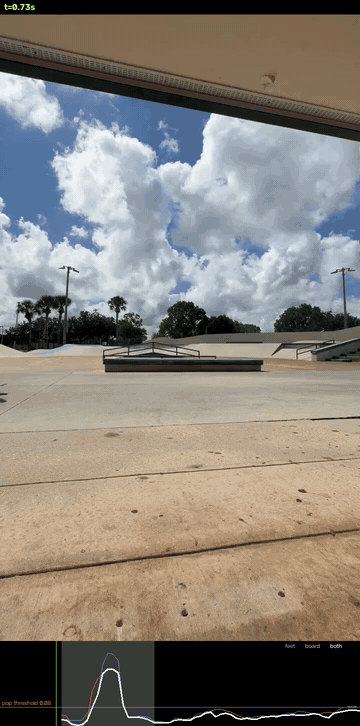
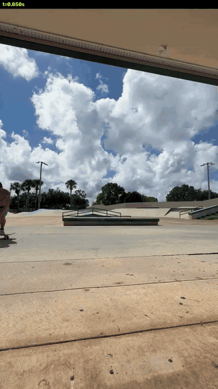
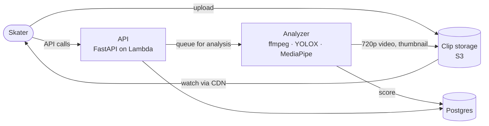

# TrickLens

Skate clip sharing with automated execution scoring.

Upload a clip, tag the trick, and get a **steeze score**: a breakdown of how
cleanly it was landed (pop, landing stability, roll-away, stomp, body
compactness, catch). Follow skaters and teams, and see the week's best on
Discover.

### Sneak peek: the analyzer on a real kickflip

<p align="center">
  
  &nbsp;&nbsp;
  
</p>

A real 60fps phone clip through the analyzer's two stages:

- **Left: finding the trick** (half speed). It tracks the skater (green)
  and board (orange), even upside-down mid-flip. The graph shows how high
  the feet, the board and both together are off the ground. When both clear
  the red threshold at once, that's a **pop**: here 1.23s, landing 1.57s.
- **Right: looking closely at that trick** (1/3 speed). The trick's window
  at full frame rate with a body-pose skeleton (feet in magenta), which pins
  take-off to 1.25s and touch-down to 1.65s.

The scores will be measured from that close-up. How it works:
[analyzer](docs/components/analyzer.md).

## How it works



1. You upload a clip straight to storage, and the **API** queues it.
2. The **analyzer** verifies and transcodes it, finds each trick, and
   measures how it was executed. Trick *names* are yours to tag; the
   analyzer only scores execution.
3. You tag the trick, review the score, and publish to your followers'
   feeds and Discover.

| Part | What it is | Docs |
|---|---|---|
| API | FastAPI on AWS Lambda: auth, clips, feed, likes, comments, teams, Discover | [api.md](docs/components/api.md) |
| Analyzer | The worker that processes every clip, and the steeze score | [analyzer.md](docs/components/analyzer.md) |
| Data model | Postgres tables and how they relate | [data-model.md](docs/components/data-model.md) |
| Services | The AWS seam, configuration and logging | [services.md](docs/components/services.md) |
| Infrastructure | AWS resources (Terraform) and CI/CD (GitHub Actions) | [infrastructure.md](docs/components/infrastructure.md) |

The full picture, with the key flows and design decisions, is in
[**ARCHITECTURE.md**](docs/ARCHITECTURE.md).

## Status

Steps 1–5 are done and **live in AWS**: auth, the full clip pipeline, the
social features, and automated deploys. Step 6, the real analyzer, is in
progress. Media processing and trick finding are live; body-pose analysis
is built; real scores come next. Until then, scores are a placeholder.
See the [build order](docs/ARCHITECTURE.md#build-order).

## Stack

| Layer | Technology |
|---|---|
| API | Python 3.12, FastAPI, SQLAlchemy 2.0 (async), Alembic |
| Analyzer | ffmpeg, YOLOX-Tiny on ONNX Runtime, MediaPipe pose, NumPy/SciPy |
| Data | PostgreSQL (Neon in production), S3 + CloudFront, SQS |
| Auth | AWS Cognito |
| Compute | AWS Lambda (container images) |
| Infra | Terraform, GitHub Actions, ECR |
| Local dev | Docker Compose + LocalStack |
| Frontend | Not built yet (planned: Next.js) |

## Run it locally

Needs Docker, `make`, and an AWS account for Cognito (everything else runs
locally).

```bash
make init    # creates .env from .env.example
make up      # build + start everything
make health  # verify every dependency is reachable
```

Then open <http://localhost:8000/docs>. One more one-time step, the Cognito
dev pool, plus every command, the tests and step-by-step API walkthroughs,
are in the [**development guide**](docs/development.md).

## Deploy

Pushing to `main` tests, builds, migrates and deploys automatically. The
one-time AWS bootstrap, the end-to-end prod check and reading the logs are
in the [**deployment guide**](docs/deployment.md).

## Repository layout

```
backend/
  app/              FastAPI app, worker, analyzer, models, services
  alembic/          migrations
  tests/            API + worker test suites
  Dockerfile        API image
  Dockerfile.worker worker image (ffmpeg + CV stack + model weights)
infra/              Terraform
.github/workflows/  CI and deploy pipelines
docs/               architecture, component docs, guides
postman/            local and prod-check collections
scripts/            LocalStack, Cognito and Terraform-state bootstrap
```
