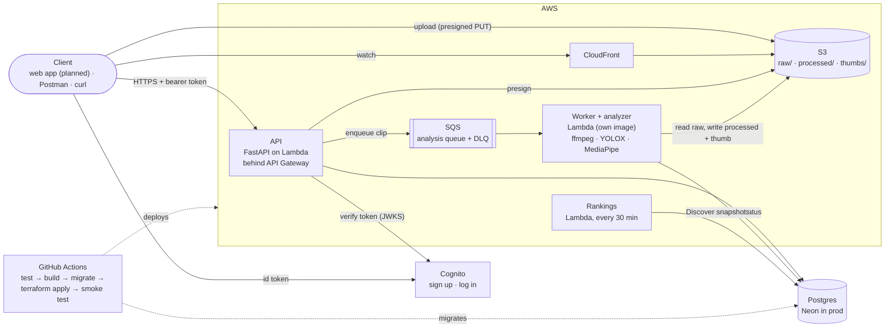
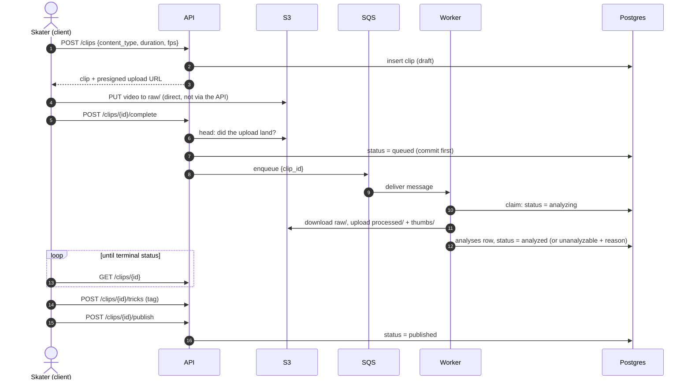
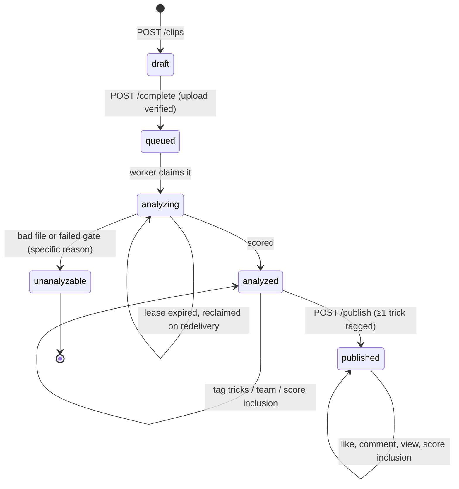
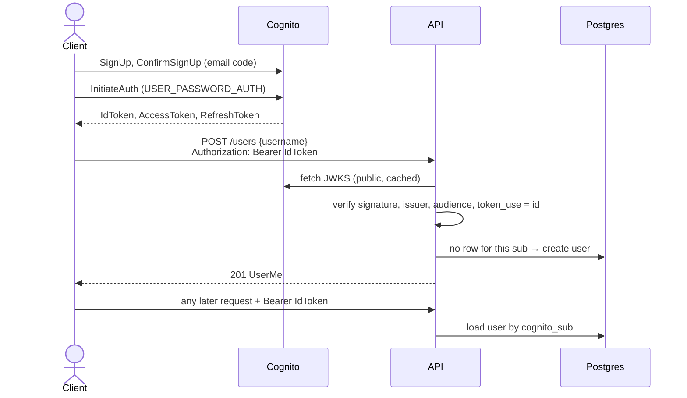

# TrickLens — Architecture

How the whole system fits together. Start with the overview diagram, then
open a component's own doc for its internals:

| Component | Doc |
|---|---|
| API (FastAPI): routes, auth, feed, Discover, engagement | [components/api.md](components/api.md) |
| Worker + analyzer: media, Stage A, Stage B, scoring | [components/analyzer.md](components/analyzer.md) |
| Data model: tables, relations, migrations | [components/data-model.md](components/data-model.md) |
| Services: the AWS seam, config, logging | [components/services.md](components/services.md) |
| Infrastructure + CI/CD: AWS resources, Terraform, pipelines | [components/infrastructure.md](components/infrastructure.md) |

Setup and day-to-day commands are in the
[development guide](development.md); deploying is in the
[deployment guide](deployment.md).

**Current state:** steps 1–5 are done and live in AWS. Step 6 (the real
analyzer) is in progress: 6a and 6b are live, 6c-1 is built. See the
[build order](#build-order).

---

## What the system does

1. A skater uploads a clip (≤30s).
2. The clip is analyzed asynchronously for **execution quality**, not trick
   identity.
3. The skater **tags the trick themselves**, reviews the score, and publishes.
4. Published clips appear in followers' feeds and compete on Discover.
5. Teams aggregate their members' scores.

---

## Overview

| Component | Role | Why it is here | Details |
|---|---|---|---|
| **API Lambda** | HTTP, auth, CRUD, presigning | Scales to zero, so no idle cost | [api.md](components/api.md) |
| **Worker Lambda** | Verifies, transcodes and analyzes each clip | Its own image (ffmpeg + CV stack, ~2.7× the API image) and its own scaling | [analyzer.md](components/analyzer.md) |
| **Rankings Lambda** | Rebuilds Discover's snapshots on a schedule | Ranking live on every page load would sort the whole clips table | [api.md](components/api.md#feed-and-discover) |
| **Postgres** | All relational state | The domain is deeply relational: follows, teams, likes, comments | [data-model.md](components/data-model.md) |
| **S3** | Video and image bytes | Never in the database; the database stores keys only | [services.md](components/services.md) |
| **CloudFront** | Media delivery | Speed, *and* the 1TB/mo always-free egress tier. Without it, bandwidth would be the largest bill | [infrastructure.md](components/infrastructure.md) |
| **SQS** | Upload → analysis buffer | Structural: analysis takes far longer than API Gateway's 29s cap | [services.md](components/services.md) |
| **Cognito** | Identity | Never store passwords; email verification and reset come free | [Auth flow](#auth-flow) |
| **EventBridge** | Scheduler | Triggers the rankings rebuild | [infrastructure.md](components/infrastructure.md) |
| **Terraform + GitHub Actions** | Infrastructure as code, CI/CD | Reproducible, reviewable, and the emergency "stop all billing" button | [infrastructure.md](components/infrastructure.md) |
| **Web app** | UI | *Not built yet.* Planned: Next.js on Vercel. A visual prototype exists outside the repo | — |

---

## Key flows

### Upload → publish

**Why the browser uploads directly to S3:** routing a 30s video through the
API would exceed Lambda's payload limit and burn compute for a pure byte
relay. The API issues a short-lived signed URL and steps out of the way.

**Why a clip stays a draft until published:** a failed analysis must never
reach a feed, and the user gets to correct the trick tag first.

What the worker does in step 10–12 is in the
[analyzer doc](components/analyzer.md#what-the-worker-does-with-one-clip).

### Clip lifecycle

`draft`, `queued`, `analyzing` and `unanalyzable` clips are visible only to
their owner (anyone else gets a 404). Team tagging is only allowed while
`analyzed`, and locks at publish. Whether the score counts toward averages
(`score_included`) stays editable forever.

### Auth flow

**Why the client talks to Cognito directly, not through this API.** The app
client is public — no secret, since a browser can't hide one — so there is
nothing for the API to mediate. Proxying signup/login would be an extra hop
with no security benefit, and would need the API to hold broader Cognito IAM
permissions than the credential-free verification it does today (JWKS
endpoints are public; checking a token needs no AWS access at all).

**Why a separate `POST /users` step, instead of a Cognito trigger
auto-creating the row.** Cognito has no idea what the app's `username` is —
that's chosen by the user and unique in this database, not in the pool. A
post-confirmation Lambda trigger could create a placeholder row, but
registration would still need a second call to set the username, plus
handling for the placeholder already existing. One JIT endpoint after first
login is simpler than both put together.

**Why the id token, not the access token, is the bearer credential.** The id
token carries `email`; the access token does not. Using it means JIT
registration and `GET /users/me` get `email` for free, at the cost of
departing from the more common pattern of access-token-for-API,
id-token-for-client.

---

## Environments

| | Local | Production |
|---|---|---|
| Database | Postgres container | Neon (`DATABASE_URL` from SSM) |
| S3 / SQS | LocalStack | Real AWS: S3 behind CloudFront, SQS + DLQ |
| Cognito | Real AWS, `tricklens-dev` pool | Real AWS, `tricklens-prod` pool |
| `AWS_ENDPOINT_URL` | `http://localstack:4566` | *(empty)* |
| API | uvicorn `--reload` | Lambda (`app.lambda_handler.handler`) behind API Gateway |
| Worker | SQS poll loop (`python -m app.worker`) | Lambda (`app.worker.lambda_handler`), SQS event-source mapping |
| Rankings | `make rankings` on demand | Lambda on an EventBridge schedule |
| Images | `backend/Dockerfile`, `backend/Dockerfile.worker` | The same two images, from ECR |

No application code branches on the environment: `AWS_ENDPOINT_URL` is the
whole local↔cloud seam for S3 and SQS, and Compose runs the exact images
Lambda runs. See [services](components/services.md) for the seam, and the
[development guide](development.md) for the local stack.

---

## Decisions

Cross-cutting decisions are below. Component-specific ones live with their
component:

- **API:** fan-out-on-read feed, precomputed Discover, batched engagement
  counts → [api.md](components/api.md#feed-and-discover)
- **Data model:** follows as two nullable FKs, one-level comment threads,
  team founding, top-10 team score, … →
  [data-model.md](components/data-model.md#design-notes)
- **Worker + analyzer:** claim and lease, local ground instead of camera
  motion, board centre + feet, in-house tracker, model weights and libEGL in
  the image, the 6c scoring decisions →
  [analyzer.md](components/analyzer.md)
- **Services:** `DATABASE_URL` in SSM, presigned URL rewriting, two
  settings classes → [services.md](components/services.md)
- **Infrastructure:** broad deploy role, migrations before deploy, no
  canary, two ECR repos, SQS timings, Terraform state bootstrap →
  [infrastructure.md](components/infrastructure.md#infrastructure-decisions)

### Neon instead of RDS

Lambda reaches RDS privately by joining a VPC — but a Lambda in a VPC loses
default internet access, so it can no longer reach S3, SQS, or Cognito.
Restoring that needs either VPC endpoints or a **NAT gateway at ~$32/month**,
billed 24/7 and in no free tier. That single line item would exceed the cost
of everything else combined.

Neon is reachable over public TLS, so Lambda stays out of the VPC entirely —
no NAT, no endpoints, no VPC cold-start penalty. It also scales to zero and
supports per-branch databases for CI. The same public reachability is what
lets the deploy pipeline run migrations straight from the GitHub runner.

Since the stack is SQLAlchemy + Alembic, Postgres is Postgres; moving to RDS
later is a connection-string change.

### Lambda instead of ECS Fargate or EC2

- **EC2 + docker-compose** — simplest, but a `t3.micro` cannot handle video
  inference, and it costs money while idle.
- **Fargate** — the most production-shaped answer and the natural upgrade
  path, but ~$15–30/month with zero traffic.
- **Lambda containers** — genuinely free at this scale, scales to zero, and
  supports 10GB images (the worker image is ~2.7GB, far past the 250MB zip
  limit). Cold starts are acceptable because analysis is already
  asynchronous.

Fargate is the documented migration path if sustained traffic ever makes cold
starts or per-invocation billing the wrong trade.

### Queue, not inline analysis

Analysis takes tens of seconds to minutes per clip, and API Gateway caps a
request at 29s. Doing the work inline isn't slow, it's impossible. SQS is
structural, not an optimization, and it also buys retries, a dead-letter
queue for poison clips, and backpressure when uploads spike.

### Cognito is real everywhere, not LocalStack

LocalStack only emulates Cognito on a paid plan — `cognito-idp` isn't in the
free tier's service list at all. Even on Pro, its JWKS endpoint has a known
bug (every key reports the same hardcoded `kid`), and issuer/signature
validation coverage has had documented gaps — exactly the surface this app's
token verification depends on being correct. Meanwhile Cognito's own free
tier (50k MAU, no 12-month expiry unlike S3's) removes any cost motive to
emulate it: there is nothing to save by faking a free service.

So dev and prod both use real Cognito — two different pools, created
directly (`scripts/cognito-bootstrap.sh` for dev, Terraform for prod)
rather than through the `AWS_ENDPOINT_URL` seam every other AWS service
uses.

**Trade-off:** local dev needs a real AWS account and network access for
auth specifically, breaking the "fresh clone, zero AWS account" property
LocalStack gives every other service. Accepted, since Cognito is the one
service here where faithful local emulation isn't actually available for
free.

### The same images in dev and production

`backend/Dockerfile` builds on `public.ecr.aws/lambda/python:3.12`. Locally,
Compose overrides the entrypoint to run uvicorn with hot-reload; in
production the Lambda runtime invokes `app.lambda_handler.handler`. Identical
layers and digest in both places, so environment drift cannot be a source of
bugs. The same holds for the worker since 6a: Compose's `worker` service
builds `backend/Dockerfile.worker`, the exact image the worker Lambda runs,
and only swaps the Lambda entrypoint for the poll loop.

### Trick classification deferred

Users tag their own tricks; the analyzer scores execution only. Trick
classification from video is research-grade, with no large public labeled
dataset. This removes the project's only research-grade risk while still
accumulating the dataset that would make classification possible later
(see [the flywheel](components/analyzer.md#the-flywheel)).

### Heuristic, explainable steeze

The score is a set of explainable subscores (pop, landing stability,
roll-away, stomp, compactness, catch) over pretrained models, always shown
broken down, and never a guess: low confidence returns `unanalyzable` with
a specific reason. A bare number reads as a bug; a breakdown reads as an
opinion. Details in the [analyzer doc](components/analyzer.md#the-steeze-score).

### YOLOX on ONNX Runtime, not Ultralytics YOLOv8 — licensing

The original plan named YOLOv8-nano. Ultralytics' library *and* its
pretrained weights are **AGPL-3.0**. Unlike the ordinary GPL, the AGPL
applies to software used over a network. Serving TrickLens with it
imported would oblige offering the whole backend's source under the AGPL,
or buying an Ultralytics Enterprise licence. TrickLens is meant to go
closed-source once it reaches a stable MVP, so neither works.

**YOLOX** (Apache-2.0) is also COCO-trained with the same `person` and
`skateboard` classes, so it needs no training either. It runs on
**ONNX Runtime** (MIT). The costs: ~150 lines of glue code Ultralytics
would have provided (resizing input frames, decoding the raw output,
filtering duplicate boxes, tracking), and slightly lower
accuracy at the same speed (COCO mAP roughly 33 for YOLOX-Tiny vs 37 for
YOLOv8n; YOLOX-S closes the gap at about 2× the compute). The detector
only has to find the skater and the board for Stage A, so the accuracy gap
matters much less than a permanent licence constraint. A side benefit:
dropping PyTorch keeps the worker image far smaller.

Guardrail: `make licenses` (run in CI by `_test.yml`) fails the build if
any Python package in the worker image declares an AGPL licence. It's
verified to catch `ultralytics`. Ultralytics' own RT-DETR port counts too:
anything installed via `pip install ultralytics` is AGPL, even models whose
original release wasn't. ffmpeg's static build is GPL (x264), which is
fine here: it runs as a separate process inside a private image that is
never distributed, and the ordinary GPL is only triggered by distribution.
The MediaPipe pose model is Apache-2.0 per its model card.

### Logging is configured for Lambda, not just locally

Every entrypoint (API, worker, rankings) calls `app.logs.configure_logging()`
at import. Until the 6b prod check, none of our `INFO` lines ever reached
CloudWatch:
- the worker and rankings configured logging only in their local
  `__main__` block;
- the API's `logging.basicConfig()` is a no-op under Lambda, because the
  runtime has already attached its own handler to the root logger;
- the root stays at Python's default `WARNING`.

So `stage A: …`, `clip … -> analyzed` and every other `log.info()` were
dropped, while warnings and errors still came through. That's why it went
unnoticed. The fix sets `INFO` on our own `tricklens` logger, so its
records propagate to whichever root handler exists: Lambda's in prod,
`basicConfig`'s locally. See [services](components/services.md#logging-logspy).

Known harmless noise in the worker's CloudWatch logs: `sh: line 1: blkid:
command not found`, `... hostname: ...` and an onnxruntime "Failed to
persist telemetry device ID" warning. All come from onnxruntime's start-up
code (disabling its telemetry doesn't stop them).

---

## Cost

| Service | Free allowance | Expected |
|---|---|---|
| Lambda | 1M requests + 400k GB-s/mo, always free | $0. The worker is the big consumer: measured at ~40 billed seconds × 3GB for a 4.7s clip with Stage A (~120 GB-s), so roughly 3,000 clips a month free. 6c adds ~12s per trick |
| SQS | 1M requests/mo, always free | $0 |
| CloudFront | 1TB egress/mo, always free | $0 |
| Cognito | 50k MAU, always free — dev and prod pools both count against this | $0 |
| EventBridge | Free | $0 |
| S3 | 5GB free 12mo, then ~$0.023/GB | ~$0.20 |
| ECR | 500MB free 12mo, then $0.10/GB-mo | ~$0.40 before 6a; more with the worker image (its big layers only change when `requirements*.txt` or the Dockerfile does, so most deploys add just the small `app/` layer) |
| Neon | Free tier | $0 |
| SSM Parameter Store | SecureString parameters + API calls at this volume, always free | $0 |
| DynamoDB (Terraform locks) | On-demand billing, negligible request volume | $0 |
| S3 (Terraform state) | A few KB, well under the free tier | $0 |
| **Total** | | **~$0.60/mo** |

Controls: S3 lifecycle rule expiring `raw/` drafts after 7 days, ECR lifecycle
policies keeping the last 5 images per repo, CloudWatch Logs retention
capped at 14 days per Lambda function, and an AWS Budget alarm at $5
(`infra/budget.tf`).

---

## Build order

| Step | Scope | Status |
|---|---|---|
| 1 | Local dev foundation — Compose, Postgres, LocalStack, FastAPI, Alembic | **done** |
| 2 | Auth (Cognito) + users + profiles | **done** |
| 3 | Upload → S3 → SQS → worker with a **stubbed** analyzer | **done** |
| 4 | Social app — feed, likes, comments, teams, discover | **done** |
| 5 | Terraform + GitHub Actions → deploy to AWS | **done, live** |
| 6 | Replace the stub with the real steeze analyzer | **in progress** |
| 6a | Worker image split, ffprobe verify + 720p transcode + thumbnail, `processed_key` (migration `0008`), worker S3 IAM + Lambda sizing, AGPL licence guard | **done, live** |
| 6b | YOLOX-Tiny + zoomed board pass, IoU tracker, local ground estimate, Stage A pop localization, apex thumbnail, `make analyze-clip` debug video | **done, live** |
| 6c | MediaPipe pose, six subscores, confidence gate, averaging landed tricks, `steeze-v0-uncalibrated` | **in progress** |
| 6c-1 | Stage B: windowed 60fps decode, pose, board around the trick, refined take-off/touch-down, libEGL + pose model in the image, per-trick debug video | **done (local); deploys advisory** |
| 6c-2 | Landed check + confidence gate | |
| 6c-3 | Measurements, calibration, averaging, migration `0009`, API, stub off | |
| 6d | Calibration against real hand-judged clips, `steeze-v1`, recalculate stored analyses | |

Step 3 deliberately stubs the analyzer so that a complete, deployed, working
product exists before the hardest component is attempted.
