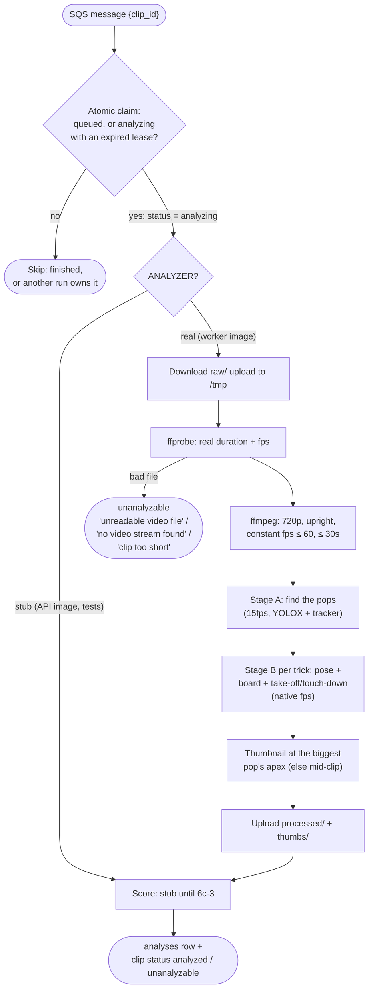

# Analyzer and worker

Everything that happens to a clip after upload: the worker that picks it
up, the media step (verify, transcode, thumbnail), and the steeze analyzer
(find the tricks, then measure them). Code: `backend/app/worker.py`,
`backend/app/analyzer/`, `backend/Dockerfile.worker`.

← Back to the [architecture overview](../ARCHITECTURE.md).

**Status:** media (6a) and Stage A (6b) are live. Stage B (6c-1) is built
and runs in advisory mode (logged, not stored). Scores are still the stub
until 6c-3. See the [build order](../ARCHITECTURE.md#build-order).

## What the worker does with one clip

Stage A and Stage B are **advisory** for now: their results are logged
(`stage A: …`, `stage B trick N: …`), and a failure in either is logged
without failing the clip. They become the source of the score in 6c-3.

## Inside the analyzer

```mermaid
flowchart LR
    proc[("processed.mp4<br/>720p, constant fps")]

    subgraph stageA ["Stage A: localize.py (whole clip, 15fps)"]
        fa["frames.py<br/>decode samples"]
        det["detect.py<br/>YOLOX-Tiny on ONNX Runtime<br/>person + skateboard"]
        crop["zoomed board pass<br/>around the skater's feet"]
        trk["track.py<br/>IoU tracker, pick the skater"]
        sig["signals: feet y, board centre y,<br/>skater height"]
        pops["elevation above local ground<br/>→ pops → trick windows"]
    end

    subgraph stageB ["Stage B: stage_b.py (one window, native fps)"]
        fb["frames.py<br/>decode the window only"]
        pose["pose.py<br/>MediaPipe BlazePose 'full'"]
        bb["board every other frame<br/>(full frame + zoomed crop)"]
        ref["refine_contacts()<br/>take-off / touch-down"]
    end

    subgraph next ["6c-2 / 6c-3 (planned)"]
        landed["landed check +<br/>confidence gate"]
        meas["measurements<br/>→ calibration.py → subscores"]
    end

    proc --> fa --> det --> trk --> sig --> pops
    det --> crop --> sig
    pops -- "window" --> fb
    proc --> fb --> pose --> ref
    fb --> bb
    ref --> landed
    bb --> landed
    landed --> meas
```

| Module | Job |
|---|---|
| `media.py` | ffprobe / ffmpeg wrappers: probe, transcode, thumbnail. Raises `MediaError` with a user-facing reason when the *file* is the problem |
| `frames.py` | Decodes the processed clip at a chosen rate through an ffmpeg pipe, optionally only a time window. Windowed decodes land on the same timestamp grid as whole-clip ones |
| `detect.py` | YOLOX-Tiny via ONNX Runtime: letterbox, decode the raw output, per-class NMS. One session per container, built on first use |
| `track.py` | Greedy IoU person tracker, and `pick_skater()`: the big, frequently-present person with a board at their feet |
| `localize.py` | Stage A: two detection passes, the elevation signals, pop finding, trick windows |
| `pose.py` | MediaPipe pose over a window: image landmarks (px + visibility) and hip-centred world landmarks (metres) |
| `stage_b.py` | Stage B: pose + board per window, refined take-off / touch-down |
| `cli.py` | `make analyze-clip`: the worker's exact path on a local file, plus debug videos |

## Worker

**Triggers.** Locally, `python -m app.worker` long-polls SQS in a loop (the
Compose `worker` service). In production, an SQS event-source mapping
invokes `app.worker.lambda_handler` once per message (`batch_size = 1`).
The processing function is the same either way; only the trigger differs.

**`ANALYZER=stub|real`.** The worker image (`Dockerfile.worker`) sets
`real` itself, because it's the image that has ffmpeg and the CV stack. The
API image leaves the default, `stub`, which skips media processing and
fabricates a score. That's why `make test` (API image) can still exercise
the whole clip flow, while `make test-worker` runs the media and analyzer
tests in the worker image.

**The claim and the lease.** One `UPDATE ... WHERE status = 'queued' OR
(status = 'analyzing' AND updated_at < now() - 360s) RETURNING id` decides
ownership, so two consumers can never process the same clip at once (SQS is
at-least-once). The lease is what recovers a crashed run. A Lambda timeout
mid-transcode leaves the clip `analyzing`, and SQS redelivers after its
visibility timeout. The stub worker skipped anything not `queued`, which
would strand it forever; now a clip still `analyzing` past the lease is
reclaimed, since it outlived the 300s Lambda timeout. Every output key is
deterministic per clip, so reprocessing just overwrites them. The ordering
matters: 300s Lambda timeout < 360s lease < SQS visibility timeout (1800s
prod, 600s local). A redelivery that arrived *inside* the lease would be
skipped and deleted.

**Errors.** A bad *file* becomes `unanalyzable` with a specific reason. Any
other exception (S3, database) propagates, so SQS retries the message (3
receives, then the dead-letter queue).

**The worker image** (`backend/Dockerfile.worker`): the API's Lambda base
image plus
- a static ffmpeg/ffprobe, copied from the pinned `mwader/static-ffmpeg`
  image, so no package manager is involved;
- the CV stack in `requirements-worker.txt`: ONNX Runtime, MediaPipe,
  headless OpenCV, NumPy, SciPy;
- `mesa-libEGL` + `libglvnd-gles`, which MediaPipe's native library needs;
- the YOLOX-Tiny and pose model weights, pinned by checksum.

It's 2.73GB locally against the API's 1GB, which is why it's a separate
image in its own ECR repo. It still reuses `app.db`, `app.models` and
`app.services` exactly like the API, because it's built from the same
`backend/app/` source.

**Lambda sizing:** 3008MB, 300s timeout, 2GB `/tmp`. Memory is really the
CPU knob (Lambda allocates ~1 vCPU per 1769MB), and 3008MB is the cap new
AWS accounts start with. It reserves no concurrency: at the initial account
quota, AWS requires at least 10 executions to stay unreserved.

**Measured in prod:**
- A routine cold start initializes in ~1.7s. The first invocation of a
  *newly deployed* image hits Lambda's 10s init limit once
  (`INIT_REPORT … Status: timeout`). Lambda re-runs init inside the
  invocation, so the clip still succeeds, just slower. Lambda loads
  container images lazily, so that first run reads every imported file from
  an empty cache. It happens once per deploy, not per cold start.
- 6a (media only): the 2.7s clip took 6.5s end to end, ~400MB.
- 6b (Stage A): the 4.7s kickflip took 10.7s of detection (5.86s full
  frame + 4.84s zoomed pass), about 5× local, or **~2.3s per second of
  clip**. Whole job 31.6s, 568MB. A 30s clip is therefore ~70s of Stage A
  within the 300s timeout.
- The rule that follows: keep the heavy CV imports (cv2, onnxruntime,
  mediapipe) inside the handler path, never at module level, or every cold
  start pays for them during init.

## Media (6a)

`media.py` turns the raw upload into the file everything else reads:

| Decision | Why |
|---|---|
| Short side scaled to 720, never upscaled | 720p is enough for phone playback and for the detectors. Short side rather than height, so portrait clips aren't squashed to 405 wide |
| Phone rotation applied (ffmpeg auto-rotate), output has no rotation metadata | Phones store portrait video as landscape pixels plus a rotation flag. Baking the rotation in means every consumer (players, the detector) sees upright frames |
| Constant frame rate at the source rate, capped at 60 | Phone footage is usually variable-frame-rate. Stage A and B turn frame indices into milliseconds, which needs evenly spaced frames. The cap keeps 120/240fps slow-mo files a sane size; `source_fps` still records the real rate |
| Capped at 30s | Clips are 30s max; this enforces it on the actual file, not just the client's claim |
| Unreadable file / no video stream / under 0.5s → `unanalyzable` with that reason | Same fail-safe rule as the scorer: the user gets a specific reason, never a guess |
| Poster frame at the apex of the biggest pop, else the middle of the clip | The most representative frame of a skate clip is the trick in the air |
| `duration_ms` / `source_fps` overwritten with ffprobe's values | The client's values (read off its `<video>` element) are only a placeholder for drafts |

Clips play from `processed/` through the CDN once it exists. That fixed a
real production bug: `raw/` expires after 7 days, so before 6a every
published clip's video died a week after upload. Pre-6a clips were not
backfilled.

## The steeze score

### What it is not

The system does **not** identify tricks. Trick classification from video is a
research-grade problem — there is no large public labeled dataset, and the
published work is mostly IMU/accelerometer-based, which does not transfer to
phone footage. It was cut deliberately.

### What it is

An **explainable heuristic** over pretrained models. No training data, no
GPUs, fully deterministic.

**Pipeline:**

1. **ffmpeg** *(6a, done)*: verify, normalize to 720p at a constant frame
   rate, cap at 30s. See [Media](#media-6a).
2. **Detect and track** *(6b, done)*: YOLOX-Tiny on ONNX Runtime finds
   people and skateboards. It's COCO-trained, which already has both
   classes, so no training is needed. Not Ultralytics YOLOv8, for licensing
   reasons (see [Decisions](../ARCHITECTURE.md#yolox-on-onnx-runtime-not-ultralytics-yolov8--licensing)).
   A small IoU tracker follows each person, and the **skater** is the big,
   frequently-present person with a board at their feet, which beats a
   bystander nearer the camera.
3. **Localize — Stage A** *(6b, done)*: at 15fps over the whole clip, find
   the **pops**, then cut a ~1.2s window around each.
4. **Score — Stage B** *(6c, in progress)*: only inside those windows, at
   native fps, using MediaPipe pose.

> Two-stage localization is what makes 30s clips affordable: full-cost
> processing runs on roughly 5% of frames, and multi-trick lines come free.

### Stage A, as built (6b)

Two decode passes over the processed 720p clip, at `SAMPLE_FPS = 15`:

1. **Full frame:** people and boards in every sample, then track people and
   pick the skater.
2. **Zoomed board pass:** crop a square of 1.4 skater-heights around the
   skater's feet and detect boards in it, merging with the full-frame boards
   (IoU dedupe). On the tripod kickflip, where the skater is ~13% of the
   frame height, full-frame-only found the board in 30/59 frames, and full
   frame + crop found it in 56/59, including mid-flip with the board
   upside-down. That matches YOLOX-S at about a quarter of the cost
   (~23ms/frame for both passes vs ~90ms). The full-frame pass still
   matters: when the board shoots away in a bail, only it sees the board.

Then, per sample, three numbers: the skater's **feet** (bottom of their
box, i.e. the lowest foot), the **board's centre**, and the skater's
**height**. From those:

- **Ground is estimated locally**: a rolling 80th percentile of each
  signal's own y over 1.5s (image y grows downward, so high y is the
  ground). The plan was to cancel camera motion instead, but measuring the
  follow-cam bail showed that motion estimated from background features
  (distant trees) made the ground drift *worse*: 40px over 1.4s, against
  23px uncorrected. The background isn't the surface the skater rolls on,
  and the skater also moves toward the camera. The local estimate absorbs
  slow camera drift and approach/recede without modelling the camera.
- **Elevation = (ground − y) ÷ standing height**, so it's in skater heights
  and camera-distance invariant. Standing height is a rolling median, not
  per frame, because the box grows mid-trick (arms up: 194 → 242px).
- **Airborne = min(feet elevation, board elevation).** On the ground the
  board box jitters by ~0.1 of the skater's height, as much as a small pop,
  while the feet are steadier. Requiring both means noise in one can't fake
  a pop, a carried board can't (feet down), and a hop off the board can't
  (board down). Where the board is missed for a few samples (edge-on
  mid-flip), the feet stand in, but each pop still needs the board itself
  to rise ≥ 0.06 somewhere.
- **The board's centre, not its bottom edge.** On a low pop the tail stays
  near the ground while the nose lifts: the bail's board bottom rose for one
  sample, while its centre rose a steady ~0.12 over four.
- **Pops** are peaks of the airborne signal ≥ `MIN_POP = 0.08`, with
  pop/landing where it crosses 30% of the peak, 130–1500ms of airtime, and
  ≥ 0.6s apart. Each becomes a window of [pop − 0.4s, max(pop + 0.8s,
  landing + 0.4s)].

**On the real clips**, also checked by eye in the debug video:

| Clip | Pop | Apex | Landing | Peak | Notes |
|---|---|---|---|---|---|
| Tripod kickflip | 1.23s | 1.47s | 1.57s | 0.32 | board caught mid-flip |
| Follow-cam bail | 1.10s | 1.13s | 1.30s | 0.093 | lands *without* the board at 1.33s, which is the evidence 6c's landed check will use |

In prod the kickflip found the identical window `(1233, 1467, 1567)`.

### Stage B, as built so far (6c-1)

For each Stage A window, `stage_b.py` decodes **just that window** at the
clip's native rate (60fps for phone footage), and in one pass:
- runs **pose** on every frame (`pose.py`): MediaPipe's BlazePose GHUM
  "full" model in VIDEO mode, on the full frame;
- runs the **board** detector on every other frame from 0.2s before the
  pop to 0.7s after the landing, with Stage A's full-frame + zoomed-crop
  merge. That covers the air and the landing check;
- **refines take-off and touch-down** from the lowest foot point's height
  above its own resting level. The level before the pop is the deck; the
  level after landing is the deck or the ground (a bail), joined by a
  line. Take-off and touch-down are where the feet cross 0.04 skater-heights.

Choices made by measuring the real clips:
- **"full" pose model:** of lite / full / heavy, heavy cost 3× (~37ms vs
  ~11ms per frame locally) for no visible gain, and full was more
  confident on the feet than lite.
- **Full frame, not a crop:** MediaPipe runs its own person detector and
  then tracks frame to frame. Cropping around the skater changed nothing.
- **Visual check:** skeletons drawn on the key frames land on the real
  joints and feet, for both the small tripod skater and the follow-cam one.

| Clip | Stage A pop / land | Stage B take-off / touch-down | Pose / feet / board found |
|---|---|---|---|
| Tripod kickflip | 1.23s / 1.57s | **1.25s / 1.65s**, matching the frames (feet reach the board ~1.62–1.65s) | 92% / 0.92 / 93% |
| Follow-cam bail | 1.10s / 1.30s | **1.08s / 1.33s**, down without the board | 100% / 0.95 / 100% |

Stage B costs ~2.3–2.6s per trick locally (decode + pose ~1.7s, board
~0.9s), so expect **~12s per trick on Lambda**. A 30s line with five tricks
would then be ~70s of Stage A + ~60s of Stage B, inside the 300s timeout.

### Decisions for the rest of 6c

- **Landed** = for 0.1–0.6s after touch-down, both feet over the board and
  near its top, with the board moving along. "Board near the feet" isn't
  enough: in the bail the flipped board lies *between* the feet at 1.45s.
- **Subscores that can't apply are left out** of the average and shown as
  n/a: catch when the feet never left the board (an ollie), and stomp when
  the board is seen end-on, so its length can't be measured.
- **New failure reason "body not clearly visible"**, for when pose can't
  follow the skater. It's more honest than reusing "no clean airtime found".
- **An analyzer crash marks the clip `unanalyzable` ("analysis failed")**
  and logs the traceback. A code bug fails the same way on every retry,
  so retrying would only park the clip in the DLQ, stuck at `analyzing`.
  Infrastructure errors (S3, database) still raise and get SQS retries.
- **Milestones:**
  - 6c-1: pose + refined contacts, deployed advisory to prove MediaPipe on
    Lambda;
  - 6c-2: landed check + confidence gate;
  - 6c-3: measurements, `calibration.py`, averaging, migration `0009`
    (`analyses.details`), API, stub off;
  - then the prod check.

### Subscores

Ranked by how reliably they compute from phone footage:

| Subscore | Signal | Robustness |
|---|---|---|
| Pop | Board apex height, normalized by skater pixel-height | High |
| Landing stability | Knee/hip oscillation, torso recovery time post-impact | High |
| Roll-away | Horizontal velocity maintained, no foot down | High |
| Stomp | Feet over bolts at impact vs. tail/nose | Medium |
| Compactness | Limb extension vs. torso during air (flail penalty) | Medium |
| Catch | How early the feet are back on the board before touch-down | Medium |

Normalizing by skater pixel-height is what makes scores camera-distance
invariant.

**Scoring a clip with several tricks** *(decided, built in 6c)*: each
subscore is averaged across the clip's **landed** tricks, and
`steeze_score` is the mean of those averages. Bails are excluded, not
averaged in as zeros, so one bail in a line doesn't sink the clip, but a
weak landed trick does pull it down. Per-trick detail is stored alongside
the breakdown for the UI.

**Calibration comes after the pipeline** *(decided)*. No public dataset
rates execution quality, so turning a raw measurement (pop height ÷ skater
height, airtime in ms, ...) into a 0–100 subscore needs constants tuned
against real, hand-judged clips. Those clips don't exist yet. So:
- 6c ships with reasonable guesses, all in one module (`calibration.py`),
  and stamps its analyses `model_version = "steeze-v0-uncalibrated"`.
- It stores each trick's **raw measurements**, not just the resulting
  scores.
- 6d tunes the constants once the clips exist, bumps the version, and
  recalculates existing analyses from those stored measurements. That
  needs no video re-run, and works even for clips whose raw upload has
  expired.

**The breakdown is always shown.** A bare number reads as a bug; a visible
breakdown reads as an opinion the user can argue with.

### The confidence gate

Low confidence returns `unanalyzable` with a **specific** reason, never a
guess: *skater too far from camera*, *trick left the frame*, *too dark*, *no
clean airtime found*, *no landed trick detected*, and (6c) *body not
clearly visible*. The media step adds the file-level reasons that come
before any scoring: *unreadable video file*, *no video stream found*, *clip
too short*.

Bails are handled by scoring only landed tricks. A clip with zero landed
tricks is rejected — rather than rejecting any clip that *contains* a bail,
which would false-positive on scuffed-but-landed tricks with no user recourse.

Until 6c-3, the **stub scorer** deliberately fails ~10% of clips with one of
these reasons, decided by the clip id (`random.Random(clip_id.int)`). An
`unanalyzable` result with `model_version: stub-v1` isn't a pipeline
failure.

### Known limits

- Steeze has no ground truth, and different tricks are not really on one
  scale — a tre flip has more ways to go wrong than an ollie. Because tricks
  are user-tagged, a later version can normalize within trick type.
- Board flips complete in ~100ms. At 30fps that is ~3 frames. Clips should be
  shot at **60fps**; source fps is stored and confidence is reduced for 30fps
  footage.
- **The bail's Stage A peak (0.093) is just over `MIN_POP` (0.08).** A
  lower pop would be missed. The threshold can't safely drop without clips
  that show what false alarms look like.
- **Terrain changes aren't modelled.** The rolling ground adopts any level
  held longer than ~0.75s. An ollie up onto a ledge or manual pad registers
  as one pop (reasonable), but on a drop or stair set the pop is found
  while the landing time and peak aren't trustworthy, because the skater
  lands lower than they took off. `MAX_AIRTIME_MS` is only a backstop.
- **A shaky handheld clip** may need real camera-shake cancelling. Neither
  test clip has it.

### The flywheel

Every published clip carries a human-supplied trick label from the person who
did the trick. Stored alongside the analysis, these accumulate into exactly
the labeled dataset a future classifier would need. Trick recognition is
deferred, not abandoned.

## Analyzer-specific decisions

### A small in-house IoU tracker, not ByteTrack (6b)

The plan named `supervision`'s ByteTrack. While building 6b it turned out
supervision deprecated ByteTrack in 0.28 and removes it in 0.31. Its
successor, Roboflow's `trackers` package (Apache-2.0), depends on the
non-headless `opencv-python`, which is the same libGL problem
`Dockerfile.worker` already works around for mediapipe, plus `rich`,
`requests` and more. ByteTrack's strengths (recovering low-score
detections, many objects crossing in a crowd) also aren't what this needs.
The job is following one skater at 15fps, usually alone or with a few
bystanders, with the board matched per frame rather than tracked.

`app/analyzer/track.py` is a greedy IoU tracker (~60 lines) that survives
an 8-sample (~0.5s) miss. `supervision` was dropped from
`requirements-worker.txt`. If crowded skatepark footage ever breaks it, the
tracker is one module to swap.

### mediapipe's OpenCV is swapped for the headless build

mediapipe depends on `opencv-contrib-python`, which needs `libGL`, and the
Lambda base image doesn't have it. The Dockerfile uninstalls it,
force-reinstalls `opencv-contrib-python-headless`, and then imports every
CV library as a build step, so a broken swap fails the build, not the first
invocation.

### The model weights are built into the image, and permissions matter

`Dockerfile.worker` downloads Megvii's official `yolox_tiny.onnx`
(0.1.1rc0) and MediaPipe's `pose_landmarker_full.task` with
`ADD --checksum`, so a changed upstream file fails the build instead of
silently changing results. Both are Apache-2.0 (the pose model per the
BlazePose GHUM model card). Lambda runs the function as a **non-root**
user, and the first attempt broke exactly there:
- `ADD` from a URL writes the file `600`, root-owned;
- `--chmod=644` also applies to any directory `ADD` creates, so `models/`
  became untraversable.

Loading the model as a non-root user failed with errno 13, which is exactly
what the worker Lambda would have hit. The directory is now created `755`
first. The weights load on first use per container (`get_detector()` is
cached), not at import, which keeps cold-start init cheap.

### MediaPipe needs libEGL, and the build proves the models load (6c)

MediaPipe 1.0's native Tasks library links against `libEGL`/`libGLESv2`
even when it only runs on the CPU, and the Lambda base image has neither.
6a's build check only *imported* mediapipe, which loads that library
lazily, so the first real pose call would have failed in prod with
`OSError: libEGL.so.1`. Found during 6c planning, before anything shipped.

`Dockerfile.worker` now:
- installs `mesa-libEGL` + `libglvnd-gles` (with the image's `microdnf`,
  which has no `-q` flag);
- runs `backend/scripts/check_models.py` **as uid 65534**, which opens the
  YOLOX session *and creates a pose landmarker*.

That check exercises every native library and file the worker Lambda
touches, as the kind of user Lambda runs as, so this class of bug now fails
the build.

## Seeing what it saw

`make analyze-clip FILE=tests/fixtures/clips/<clip>` runs exactly the
worker's path on a local file. It prints the windows, Stage B per trick and
timings, and writes debug videos under `tests/fixtures/clips/_debug/`:

- `<clip>.debug.mp4` (Stage A): skater and board boxes, the elevation
  curves (feet, board, both) against the pop threshold, and the trick
  windows;
- `<clip>.trick<N>.debug.mp4` (Stage B): the window at full rate, played at
  1/3 speed, with the pose skeleton, feet, board and take-off/touch-down
  marked.

Those videos are the real check on the analyzer until calibration (6d).
The README's sneak-peek GIFs are made from them.

**Tests:** synthetic signal tests for Stage A and Stage B (no models, run
in CI), detector/tracker tests with a hand-built model output, and tests on
the real clips in the gitignored `backend/tests/fixtures/clips/` (local
only). See the [development guide](../development.md#tests).
