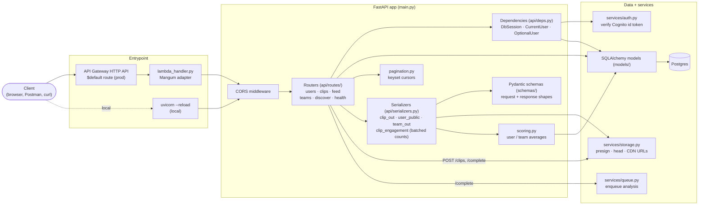
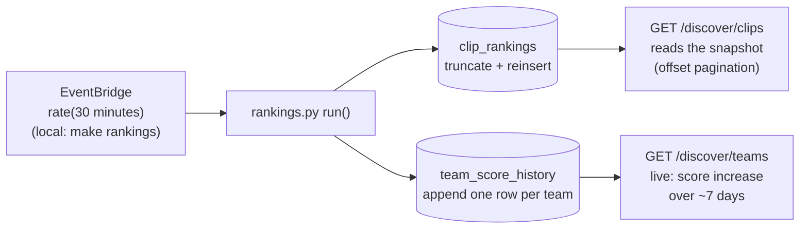

# API

The FastAPI application: authentication, users and profiles, the clip
lifecycle, the social features (follows, feed, likes, comments, teams,
Discover) and health checks. Code: `backend/app/main.py`,
`backend/app/api/`, `backend/app/schemas/`, `backend/app/scoring.py`.

← Back to the [architecture overview](../ARCHITECTURE.md).

## Inside the API

A request goes through:

1. **Entrypoint.** In production, API Gateway's single `$default` route
   proxies everything to the API Lambda, where `lambda_handler.py`'s
   [Mangum](https://mangum.fastapiexpert.com/) adapter turns the Lambda
   event into an ASGI request. Locally, uvicorn serves the same app with
   hot reload. It's the same code and the same image (see
   [Decisions](../ARCHITECTURE.md#decisions)).
2. **Router.** One module per area in `api/routes/`. Routes stay thin:
   validate, load, check permissions, write.
3. **Dependencies** (`api/deps.py`) inject:
   - `DbSession`: one `AsyncSession` per request, committed on success;
   - `CurrentUser`: verifies the bearer token with `services/auth.py`, then
     loads the matching `users` row. A valid token with no row is a 404
     telling the client to `POST /users`, not a 401;
   - `OptionalUser`: the same for public routes that show extra fields to a
     signed-in viewer. A *present but invalid* token still 401s.
4. **Serializers** (`api/serializers.py`) are the only place ORM objects
   become response schemas. Routes never return ORM objects (CLAUDE.md
   convention). Serializers also build media URLs from stored S3 keys at
   response time, and compute engagement counts and averages.
5. **Services** are the only code that talks to AWS. The clip routes use
   `storage` (presign the upload, check it landed) and `queue` (hand the
   clip to the worker). See the [services doc](services.md).

## Endpoints

| Router | Endpoints |
|---|---|
| `health` | `GET /health` (liveness), `GET /health/deep` (Postgres + schema revision, S3, SQS, Cognito; 503 if any fail) |
| `users` | `POST /users` (JIT registration), `GET/PATCH /users/me`, `PATCH /users/me/profile`, `GET /users/{username}`, `POST/DELETE /users/{username}/follow` |
| `clips` | `POST /clips`, `POST /clips/{id}/complete`, `GET /clips/{id}`, `POST /clips/{id}/tricks`, `PATCH /clips/{id}/team`, `PATCH /clips/{id}/score-inclusion`, `POST /clips/{id}/publish`, `POST/DELETE /clips/{id}/like`, `POST /clips/{id}/view`, `POST/GET /clips/{id}/comments`, `DELETE /clips/{id}/comments/{comment_id}` |
| `feed` | `GET /feed` (keyset-paginated) |
| `teams` | `POST /teams`, `GET/PATCH/DELETE /teams/{slug}`, `GET /teams/{slug}/members`, `PATCH/DELETE /teams/{slug}/members/{username}`, `POST/DELETE /teams/{slug}/join`, `GET /teams/{slug}/join-requests`, `POST /teams/{slug}/join-requests/{username}/accept\|reject`, `POST /teams/{slug}/invites`, `GET /teams/invites/mine`, `POST /teams/{slug}/invites/mine/accept\|reject`, `POST/DELETE /teams/{slug}/follow` |
| `discover` | `GET /discover/clips?sort=score\|engagement`, `GET /discover/teams` |

The full request/response shapes are in the interactive docs at
`http://localhost:8000/docs` while the stack is running. Step-by-step
walkthroughs for every area are in the
[development guide](../development.md#walkthroughs).

**Visibility rule:** something you can't see at all (someone else's draft
clip, an unfounded team you're not part of) is a **404**, never a 403. A 403
would confirm it exists. Acting on something you *can* see but that isn't
in the right state (liking your own draft) is a **409**.

## Clip routes and the lifecycle

The clip routes move a clip through its statuses (the
[lifecycle diagram](../ARCHITECTURE.md#clip-lifecycle) shows all of them):

- `POST /clips` creates a `draft` row and returns a presigned S3 upload URL.
  The browser uploads straight to S3; the bytes never pass through the API.
- `POST /clips/{id}/complete` checks the object actually landed (`head`),
  sets `queued`, commits, *then* enqueues. Committing first matters because
  the worker can receive the message before a still-open transaction would
  have committed.
- The worker takes it from there (see the [analyzer doc](analyzer.md)).
- `POST /clips/{id}/tricks` (only while `analyzed`) tags tricks by name. An
  unknown name creates a `tricks` row; there's no alias matching yet.
- `POST /clips/{id}/publish` needs at least one tagged trick.

`video_url` is the `processed/` transcode's CDN URL once the worker has made
one, and until then a presigned URL for the raw upload. `thumb_url` is the
poster frame's CDN URL.

## Feed and Discover

**Home feed: fan-out-on-read.** `GET /feed` queries `clips` directly,
filters to `published`, orders by `(published_at, id)` descending,
keyset-paginated: the response carries a `next_cursor` (`"<published_at>|<id>"`)
that the client passes back as `?cursor=`, becoming `WHERE (published_at, id)
< (?, ?)`. Keyset rather than `OFFSET` because offset pagination degrades
linearly and skips rows when new clips arrive mid-scroll. One extra row is
fetched per page (`LIMIT n+1`) purely to know whether `next_cursor` should be
set. A clip embeds its `author` (a `UserBrief`) so the feed needs no
follow-up lookup per row.

**Team follows (4c)** are folded in as `Clip.user_id.in_(followed users)
OR Clip.team_id.in_(followed teams)` — two `IN` subqueries against `follows`,
not a `JOIN` on that OR condition. A join would emit a clip twice when both
its author *and* its tagged team are followed; de-duping a joined result
afterward is more awkward than just not producing the duplicate in the first
place.

Fan-out-on-*write* (precomputed per-user timelines) is the standard answer at
large scale, but it costs a write per follower per post and needs backfill
logic. At this scale it is unjustified complexity.

**Discover: precomputed (4d).**

`app/rankings.py`'s `run()` rebuilds `clip_rankings` (this week's clips,
ranked) and appends one `team_score_history` row per founded team, in a
single pass. Discover is a hot page and ranking live — sorting the whole
`clips` table on every load — would be an expensive query; reading a small
pre-sorted snapshot instead is cheap regardless of how many clips exist.

`GET /discover/clips?sort=score|engagement` reads `clip_rankings` directly,
plain offset-paginated rather than keyset: unlike the home feed, this reads a
snapshot that's frozen between rebuilds, so keyset's usual justification
(rows shifting under a paginating client) doesn't apply, and jumping to an
arbitrary page of a ranked list is a reasonable thing to want. `sort=score`
leaves out `score_included = false` clips; `sort=engagement` doesn't (see
the [data model](data-model.md#design-notes) for the weights).
`GET /discover/teams` is the one live-computed exception — ranked by score
*increase* (latest `team_score_history` snapshot minus the one closest to 7
days earlier, per team), computed at request time because the number of
teams is small enough that this is cheap, unlike sorting every clip. A team
with no snapshot from that far back (brand new) is excluded rather than
credited a fake increase-from-zero, which would otherwise let any
freshly-founded team trivially top the list.

**Same dev/prod trigger split as the worker:** locally, `make rankings`
runs the rebuild on demand; in production an EventBridge rule invokes
`app.rankings.lambda_handler` on a schedule (`rate(30 minutes)` by
default). Nothing runs it automatically in dev — there's no scheduler in
docker-compose.

`average_score` on `GET /users/{username}` and `GET /teams/{slug}` is
computed live by `app/scoring.py` (a user's: uncapped; a team's: its top 10
clips). The rankings job uses the same functions for its snapshots, so the
live number and the history can't drift apart.

## Engagement counts

Likes and comments (step 4b) add three fields to `ClipOut`: `like_count`,
`comment_count`, `liked_by_me`. `view_count` (4d, backed by `clip_views` and
`POST /clips/{id}/view`) joined them as a fourth. All four are computed in
`api/serializers.py`'s `clip_out()`, which takes `db` and an optional
`viewer`, plus optional precomputed values for each.

**Single-clip routes** (everything in `routes/clips.py`) let `clip_out`
query directly — one `COUNT` per metric, one lookup for `liked_by_me` — the
same per-call cost `user_public()` already pays for
`follower_count`/`following_count`/`followed_by_me`.

**The feed and Discover are different**: both call `clip_out` in a loop over
up to 50 clips per page, so paying a query per clip per metric there would
mean hundreds of queries per page load. `clip_engagement()` batches all four
into one grouped query per metric for the whole page — `GROUP BY clip_id`
for the three counts, one `IN (...)` lookup for the viewer's likes — and
`feed.py`/`routes/discover.py` pass the results into `clip_out` as
precomputed values, skipping its default per-clip queries entirely.

Comment listing (`GET /clips/{id}/comments`) doesn't need the same
treatment: it returns *comments*, not clips, and a comment's replies load via
`.options(selectinload(Comment.replies))` on the query — SQLAlchemy's own
batched-eager-load strategy, so a page of top-level comments plus every reply
on it is two queries total, not N+1, with no hand-written batching needed.
Note this has to be requested explicitly in the query, unlike
`Clip.analyses`/`Clip.clip_tricks`: SQLAlchemy never auto-applies a
relationship's default `lazy=` strategy when it's self-referential, the way
`Comment.replies` is — see the gotcha in `CLAUDE.md` and the comment on
`Comment.replies` in `app/models/social.py`.

## Health checks

- `GET /health` only says the process is up.
- `GET /health/deep` checks, concurrently, each with its latency:
  - **postgres:** connects, then compares `alembic_version` with the head
    revision in the image's own `alembic/` directory. A mismatch or missing
    table is a failure, so an unmigrated database can't pass;
  - **s3:** the media bucket is reachable;
  - **sqs:** the analysis queue is reachable (also reports waiting and
    in-flight messages);
  - **cognito:** the pool's JWKS can be fetched.

  Any failure turns the response into a 503 and names the dependency and
  error. The deploy pipeline's smoke test is this endpoint (see
  [infrastructure](infrastructure.md#cicd-pipeline)).

## Logging

`main.py` calls `app.logs.configure_logging()` at import, like every other
entrypoint, so INFO lines reach CloudWatch under Lambda as well as the
terminal locally (see [Decisions](../ARCHITECTURE.md#decisions)).
