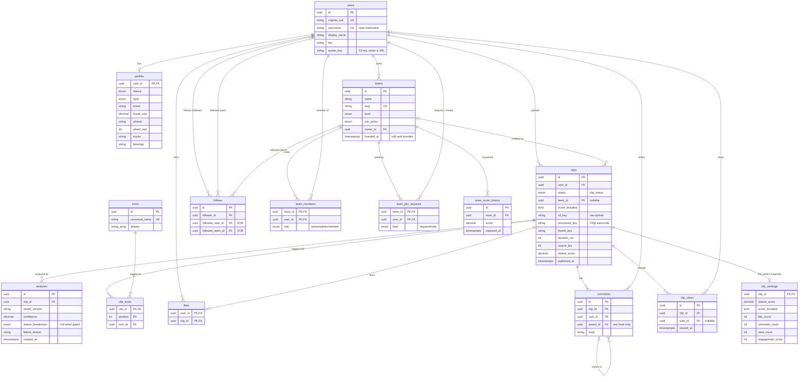

# Data model

Postgres schema behind everything: users, clips and their analyses, the
social graph, teams, and the Discover snapshots. SQLAlchemy models live in
`backend/app/models/`, migrations in `backend/alembic/versions/`.

← Back to the [architecture overview](../ARCHITECTURE.md).

## Entity relationships

The tables fall into four groups:

- **Identity:** `users`, `profiles`. Identity itself (email, password)
  lives in Cognito; `users` only links to it through `cognito_sub`.
- **Clips and analysis:** `clips`, `analyses`, `tricks`, `clip_tricks`.
  A clip moves through `clip_status` (see the
  [lifecycle diagram](../ARCHITECTURE.md#clip-lifecycle)). Each worker run
  appends an `analyses` row, and the latest one is what the API shows.
  Tricks are always user-tagged, never predicted.
- **Social:** `follows`, `likes`, `comments`, `clip_views`, and teams
  (`teams`, `team_members`, `team_join_requests`).
- **Discover snapshots:** `clip_rankings` (rebuilt wholesale) and
  `team_score_history` (append-only), both written by `app/rankings.py`
  (see the [API doc](api.md#feed-and-discover)).

Enum types: `stance`, `skate_style`, `clip_status`, `team_level`,
`join_policy`, `team_role`, `join_request_kind`. Every enum column goes
through `app.models.enums.sa_enum()` (see CLAUDE.md's gotcha on SQLAlchemy
sending `.name` instead of `.value`).

## Migrations

| Revision | Step | Adds |
|---|---|---|
| `0001` | 1 | `users`, `profiles`, `stance`/`skate_style` enums |
| `0002` | 2 | `users.cognito_sub` becomes non-nullable |
| `0003` | 3 | `clips`, `analyses`, `tricks`, `clip_tricks`, `clip_status` enum |
| `0004` | 4a | `follows` (user and team followee columns, XOR check) |
| `0005` | 4b | `likes`, `comments` |
| `0006` | 4c | `teams`, `team_members`, `team_join_requests`, `clips.team_id`/`score_included`, the deferred `follows.followee_team_id` FK |
| `0007` | 4d | `clip_views`, `clip_rankings`, `team_score_history` |
| `0008` | 6a | `clips.processed_key` |

Production runs `alembic upgrade head` *before* the new code goes live, so
every migration must be backward-compatible with the previous code (see
[Migrations run before the new image goes live](infrastructure.md#migrations-run-before-the-new-image-goes-live-never-after)).

## Design notes

- **UUID primary keys** — IDs appear in public URLs; sequential integers leak
  counts and allow enumeration.
- **`profiles` is a separate table** — every field is optional and rarely
  read, and `users` is joined on nearly every query.
- **`avatar_key`, not `avatar_url`** — storing URLs breaks every row the day
  a CDN is introduced.
- **`email` is never stored in `users`** — Cognito is the system of record
  for identity attributes. The API reads it off the verified id token per
  request instead of duplicating it and risking drift.
- **`cognito_sub` is non-nullable as of step 2.** Step 1 left it nullable on
  purpose, before auth existed to populate it; every row now comes through
  JIT registration with a sub already in hand.
- **`clips.s3_key` is always the raw upload; `processed_key` is what plays
  (6a).** `raw/` expires after 7 days, so nothing that must outlive a draft
  can point at `s3_key`. `processed_key` is null for clips the worker hasn't
  transcoded. See the [analyzer doc](analyzer.md#media-6a).
- **`clips.team_id` (4c)** is nullable and `ON DELETE SET NULL`, unlike
  `user_id`'s `CASCADE` — a team disbanding should detach the credit from a
  clip, not delete the clip. It's set via `PATCH /clips/{id}/team`, which
  only accepts a team the caller is currently a member of, and only while
  `status == ANALYZED` — a one-time, pre-publish decision, locked after
  that (a team tag is credit for a specific roster at a point in time, not
  something that makes sense to reassign later).
- **`tricks.canonical_name` is a plain unique column, not a functional
  `lower()` index like `users.username`.** The API pre-normalizes it before
  insert, and — unlike a username — there's no display casing worth
  preserving for a trick name.
- **`clip_tricks`' primary key is `(clip_id, position)`, not `(clip_id,
  trick_id)`.** Position is what actually needs to be unique per clip (one
  trick per slot in a line); a trick could in principle repeat.
- **`follows` targets a user *or* a team, as two nullable FKs + a check
  constraint** — not an untyped `(followee_type, followee_id)` pair. The
  home feed pulls clips from followed users *and* teams, so the target
  genuinely is polymorphic; two real FK columns keep Postgres enforcing
  referential integrity and cascade-deletes on both sides, which a bare
  `followee_id` couldn't. The column and check landed in 4a's migration
  before `teams` existed; 4c's migration adds the deferred FK constraint now
  that it does.
- **`likes` has no surrogate id** — `(user_id, clip_id)` is the primary key
  directly, same reasoning as `clip_tricks`: a like has no identity beyond
  "this user liked this clip", so a separate UUID plus a unique constraint
  would just be a redundant second index.
- **`comments.parent_id` threads exactly one level deep** — a reply's
  `parent_id` must reference a top-level comment, never another reply. That
  rule is a cross-row condition (the referenced row's own `parent_id` must
  be null), which a plain `CHECK` constraint can't express without a
  trigger; this codebase has no procedural DB logic anywhere else (the
  closest precedent is `app/models/enums.py` pushing enum-value mapping into
  Python rather than the database), so it's enforced in `routes/clips.py`
  instead. `parent_id`'s `ondelete="CASCADE"` means deleting a top-level
  comment deletes its replies too.
- **A team isn't "real" until `founded_at` is set** — null from creation
  until every founding invite is accepted, same idiom as `Clip.published_at`
  marking a not-yet-live row rather than a separate status enum. `POST
  /teams` requires at least 2 founding invitees (a floor, not a cap) in
  addition to the owner; while `founded_at IS NULL` the team is invisible to
  everyone but the owner and those invitees (same 404-not-403 rule as clip
  drafts), and can't be joined, followed, or tagged onto a clip. Accepting
  the last outstanding founding invite stamps `founded_at`; rejecting *any*
  founding invite — or the owner cancelling, which is the same
  `DELETE /teams/{slug}` call whether the team is pending or live — deletes
  the whole `Team` row via `ON DELETE CASCADE`, undoing the attempt entirely
  rather than leaving a partially-formed team behind. The name/slug are free
  again immediately, so it can be redone from scratch.
- **`team_join_requests` serves two directions through one table**, not two
  near-identical ones: `kind = request` is a user asking to join (an
  owner/admin resolves it), `kind = invite` is an owner/admin asking a user
  to join — including the founding invites above — which only that user can
  accept or reject. There's no `status` column: a row's existence means
  pending, and resolution either deletes it (reject) or deletes it while
  inserting a `team_members` row (accept) — the same hard-delete idiom
  `follows`/`likes` already use, no history kept.
- **`team_members.role` is `owner`/`admin`/`member`.** Exactly one row per
  team holds `owner`, mirroring `teams.owner_id`. An admin can approve/reject
  join requests and remove a plain member, but not another admin or the
  owner; only the owner changes roles, sends founding-adjacent settings
  changes, or deletes the team. There's no ownership-transfer flow yet — an
  owner can't leave, only delete the team outright.
- **A hard cap of 20 `team_members` rows per team**, enforced in the route
  layer at every membership-creating call (open join, invite-accept,
  request-accept) — not expressible as a `CHECK` constraint, since it's a
  count over a related table, not a property of one row.
- **`clips.score_included` (4c)**, unlike `team_id`, stays editable forever
  — including indefinitely after publishing, as an edit to the post, via
  `PATCH /clips/{id}/score-inclusion`. It never touches `analyses`; the
  existing scoring pass is reused as-is either way. This exists because
  skate clips are often shot from angles the analyzer scores unreliably, and
  the app doesn't want users choosing between a visually great clip and
  their average — a clip can publish and be watched regardless of this
  flag, it just won't count toward a personal or team average.
- **`team_score_history` exists because Discover ranks teams by score
  *increase*.** A delta is uncomputable without history, and this is painful
  to retrofit.
- **Team score = average of the team's top 10 clips.** Summing everything
  would mean the largest team always wins and scores could never fall. A
  user's own `average_score` (4d) has no analogous fairness problem, so it's
  an uncapped average across every published, score-included clip. Both live
  in `app/scoring.py`, shared by `api/serializers.py` (live display on
  `UserPublic`/`TeamOut`) and `app/rankings.py` (the `team_score_history`
  snapshot) — one definition, so the two can't quietly drift apart.
- **`clip_views` (4d) is a plain append-only event log, not deduped like
  `Like`.** A rewatch counts again — `view_count` is a raw play-count, same
  as most platforms show, not a unique-viewer count. The clip owner's own
  views are never inserted at all: unlike a like, capped at +1/user by
  construction, a raw view endpoint has no such limit, so self-view spam
  would otherwise be a trivial way to inflate the Discover engagement
  ranking below.
- **`clip_rankings` (4d) is fully truncated and reinserted on every
  `app/rankings.py` run**, one row per clip published in the last 7 days —
  the same "no surrogate id" reasoning as `likes`, since the table's only
  meaning is "this week's snapshot." It carries its own copies of
  `steeze_score`/`score_included` and the three engagement counts rather
  than joining back to `clips`, so a rebuild is one clean pass with nothing
  to reconcile. Reading it back (`routes/discover.py`) re-fetches the live
  `Clip` rows it names, in the order it says — display data is always
  current even though the *ordering* is only as fresh as the last rebuild.
- **Discover's engagement ranking blends three signals with different
  weights** — `view_count×1 + like_count×5 + comment_count×10`
  (`app/rankings.py`'s `ENGAGEMENT_WEIGHTS`) — rather than exposing three
  separate sort orders. Comments weighted highest and views lowest: a view
  costs a viewer nothing, a like takes one tap, a comment takes real effort.
  The numbers are a starting heuristic, not derived from data; they're
  centralized as named constants specifically so they're a one-line change,
  not a redesign, once real usage suggests better ones. This ranking has no
  relation to the `score` ranking's `score_included` filter — engagement is
  a deliberately separate signal from the steeze score, for skaters who'd
  rather browse what looks good than what scored well.
