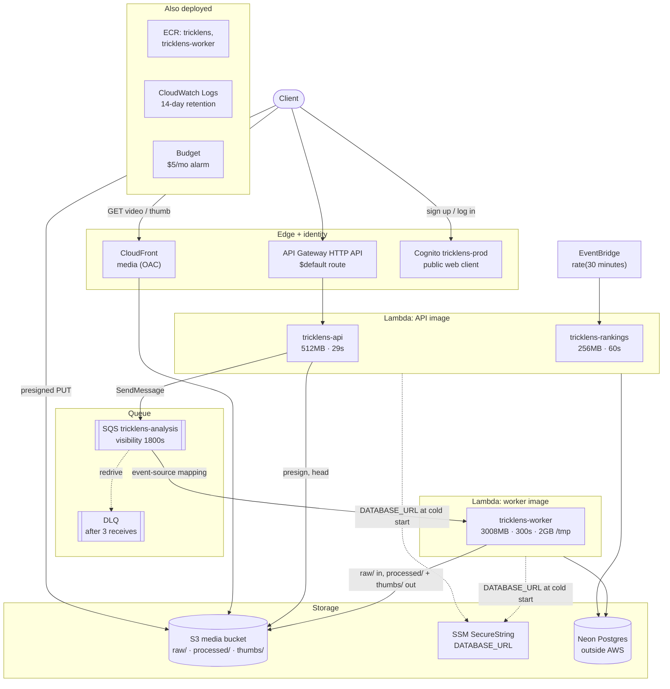
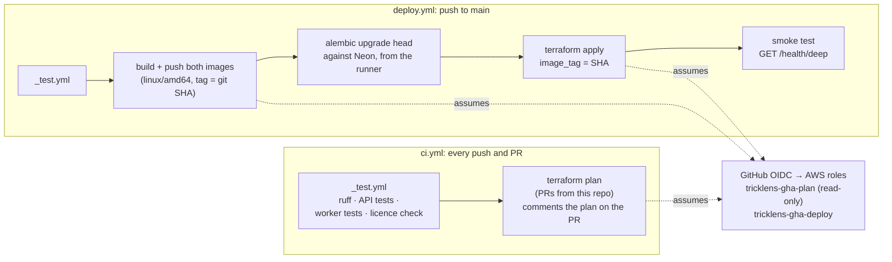

# Infrastructure and CI/CD

The AWS resources TrickLens runs on, the Terraform that defines them, and
the GitHub Actions pipelines that test and deploy it. Code: `infra/`,
`.github/workflows/`, `scripts/`. The step-by-step setup is in the
[deployment guide](../deployment.md).

← Back to the [architecture overview](../ARCHITECTURE.md).

## AWS resources

| Resource | File | Notes |
|---|---|---|
| ECR `tricklens`, `tricklens-worker` | `ecr.tf` | Two repos, each keeping its last 5 images. Separate repos so each has its own rollback history |
| Lambda `tricklens-api` / `-worker` / `-rankings` | `lambda.tf` | API and rankings share the API image, selected by `image_config.command`. The worker has its own image |
| API Gateway HTTP API | `api_gateway.tf` | One `$default` route, `AWS_PROXY` integration, payload format 2.0 |
| SQS `tricklens-analysis` + DLQ | `sqs.tf` | Visibility timeout 1800s (6× the worker's 300s timeout); `maxReceiveCount` 3; event-source mapping with `batch_size = 1` |
| S3 media bucket | `s3.tf` | Bucket name includes the account id. 7-day expiry on `raw/`. Public access blocked, readable only by CloudFront |
| CloudFront | `cloudfront.tf` | Origin Access Control to S3, `GET`/`HEAD` only, `PriceClass_100` |
| Cognito `tricklens-prod` | `cognito.tf` | Email as username, email verification, public client (no secret), `USER_PASSWORD_AUTH` |
| EventBridge rule | `eventbridge.tf` | Invokes the rankings Lambda on `var.rankings_schedule_expression` (`rate(30 minutes)`) |
| SSM parameter | `secrets.tf` | `DATABASE_URL` as a SecureString (see [services](services.md#database_url-comes-from-ssm-in-production)) |
| IAM | `iam.tf` | One least-privilege role per Lambda, plus the GitHub OIDC provider and two CI roles |
| CloudWatch log groups | `cloudwatch.tf` | Pre-created with 14-day retention, so Lambda doesn't create never-expiring ones |
| Budget | `budget.tf` | $5/month, emails at 80% and 100% |

**Lambda environment.** All three functions get the same plain env vars
(bucket, queue URL, CDN URL, Cognito IDs, the SSM parameter *name*), because
`Settings` requires them all to construct. `AWS_REGION` and the other
reserved names are left out: Lambda injects them itself, and Terraform
rejects them. `AWS_ENDPOINT_URL` is absent, which is what makes boto3 use
real AWS (see [services](services.md)).

**Lambda execution roles** (`iam.tf`):

| Role | Can do |
|---|---|
| API | `s3:PutObject`/`GetObject`/`ListBucket` on the media bucket, `sqs:SendMessage`/`GetQueueAttributes`, read the SSM parameter |
| Worker | Receive/delete from the analysis queue, `s3:GetObject` on `raw/*` only, `s3:PutObject` on `processed/*` and `thumbs/*` only, read the SSM parameter |
| Rankings | Read the SSM parameter (it only touches Postgres) |

`infra/` is one Terraform root module, one file per AWS service, plus
`versions.tf`/`providers.tf`/`backend.tf` and `variables.tf`/`outputs.tf`.
`make tf-init` / `tf-plan` / `tf-apply` wrap the `terraform -chdir=infra`
commands.

## CI/CD pipeline

- **`_test.yml`** is reusable, called by both pipelines. It runs the same
  commands a developer runs locally (`make init`, ruff, `make test`,
  `make test-worker`, `make licenses`) against real Postgres and LocalStack
  under Docker Compose, rather than re-describing the stack as Actions
  `services:` containers.
- **`ci.yml`** runs the tests on every push and PR. On a PR from a branch
  of this repo (not a fork), it also runs `terraform plan` with the
  read-only role and comments the plan on the PR.
- **`deploy.yml`** runs on every push to `main`. The jobs are strictly
  sequential: the ordering itself is a safety property (see below). There's
  no manual approval gate, by choice, for a solo-dev project.

Rollback is `terraform apply -var image_tag=<previous_sha>` (see below).

## Infrastructure decisions

### GitHub Actions' deploy role is broad by design, not by oversight

`infra/iam.tf` defines two IAM roles GitHub Actions assumes via OIDC (no
static AWS keys stored in GitHub, ever): `tricklens-gha-plan` (PR-triggered
`terraform plan` only, read-only, no `iam:PassRole`) and
`tricklens-gha-deploy` (push-to-`main` only, close to `PowerUserAccess`
scoped by resource name/ARN prefix wherever the AWS API supports it). The
deploy role's breadth is a deliberate trade-off, not an oversight: `terraform
apply` is the thing creating/mutating every resource in `infra/`, so a role
narrow enough to avoid "broad" would also be too narrow to actually deploy.
The alternative — a human runs `terraform apply` locally instead of CI —
reintroduces exactly the problem this project already structures itself
around avoiding (three independent machine clones per CLAUDE.md's
Environment section, easy to let drift), and breaks "auto-deploy on push to
`main`, no manual approval gate," chosen deliberately for a solo-dev hobby
project. The actual safety net here is the $5 AWS Budget alarm
(`infra/budget.tf`), not IAM scoping — plus an explicit `Deny` on the
handful of actions (`iam:CreateUser`, `iam:CreateAccessKey`, …) that would
let the role mint a persistent credential if it were ever misused.

Both trust policies pin the OIDC `sub` claim to GitHub's **immutable subject**
format, `repo:<owner>@<owner_id>/<repo>@<repo_id>:...`
(`var.github_oidc_sub_prefix`), not the name-only `repo:<owner>/<repo>:...`.
This repo has immutable subjects enabled, so GitHub never sends the
name-only form. The first live deploy failed on exactly this mismatch, and
AWS reported it only as a bare `Not authorized to perform
sts:AssumeRoleWithWebIdentity`. The numeric IDs are also the safer form:
if the repo is renamed or deleted and its name re-registered by someone
else, that repo's tokens carry different IDs and can't satisfy the trust
policy.

Both roles also get `dynamodb:GetItem`/`PutItem`/`DeleteItem` on the state
lock table, scoped to that one table's ARN. The table lives outside this
config (see `infra/backend.tf`), so nothing in `infra/` referenced it, and
the first CI apply failed on "Error acquiring the state lock" before it
read any state. Any role that runs `terraform plan`/`apply` against this
backend needs those three actions.

### Migrations run before the new image goes live, never after

`.github/workflows/deploy.yml` runs `alembic upgrade head` against Neon
directly from the GitHub Actions runner (no Lambda/ECS detour needed — this
is exactly why Neon's public TLS reachability mattered when it was chosen
over RDS) as a job that must complete before `terraform apply` updates the
three Lambdas' `image_tag`. This ordering is deliberate: between those two
jobs, the *old*, still-live code runs briefly against the *new* schema —
the safe direction, since old code encountering a column it doesn't know
about is a no-op, while new code encountering a column that doesn't exist
yet is a hard crash. The cost of this ordering is a standing rule (also in
CLAUDE.md's Conventions): every migration that ships in the same deploy as
code that depends on it must be additive/backward-compatible on its own —
new columns nullable-first or defaulted, no dropping/renaming a column the
still-deploying old code reads. A genuinely breaking schema change needs
two separate deploys (add the new shape, migrate code to use it, then drop
the old shape in a later deploy), not one.

Three properties keep that ordering real rather than nominal:

- **Alembic needs only the database URL.** `alembic/env.py` reads
  `app.config.get_migration_settings()`, a DB-only subset of `Settings`, not
  `get_settings()`. The runner has only `ALEMBIC_DATABASE_URL`. The full
  `Settings` also requires `S3_BUCKET`/`SQS_ANALYSIS_QUEUE_URL`/`CDN_BASE_URL`,
  so on the first live deploy every migration attempt failed with a
  validation error.
- **A failed migration fails the job.** The Neon cold-start retry loop runs
  its last attempt outside the loop, so that attempt's exit code becomes the
  step's. The first version ended the loop on `sleep 5`, which exited 0. On
  the first deploy, all five attempts failed, yet `migrate` showed green and
  the pipeline moved on to `terraform apply` against an empty schema.
- **The smoke test verifies the schema, not just connectivity.**
  `/health/deep`'s `postgres` check compares `alembic_version` against the
  head revision(s) in the image's own `alembic/` directory, and 503s on a
  mismatch or a missing `alembic_version` table. `SELECT 1` alone passes on
  an empty database, so the smoke test would not have caught the failure
  above. This is detection, not prevention: by the time the smoke test runs,
  the new image is already live. Its job is to turn a silent unmigrated
  deploy into a red pipeline.

### No Lambda aliases / canary rollout — `terraform apply` is the rollback path

Lambda supports versioned aliases and weighted traffic-shifting for gradual
rollout with automated alarm-triggered rollback (often paired with
CodeDeploy). Skipped here: that machinery earns its cost protecting against
concurrent-old-and-new-code-serving-real-traffic during a rollout, which
doesn't really exist yet at "$0.60/mo, solo user, infrequent deploys" scale.
Instead: the ECR lifecycle policies keep the last 5 image tags per repo
(`infra/ecr.tf`), and Terraform state records exactly which `image_tag` (the
deploying git SHA) was live at every apply, so a manual rollback is
`terraform apply -var image_tag=<previous_sha>` — one command, not a
runbook. Revisit if deploy frequency or real traffic grows enough that a
bad deploy's blast radius during rollout starts to matter — same "not yet
justified" treatment given to the Fargate migration path.

### Two images, two ECR repos, one tag

API and rankings share the API image (`backend/Dockerfile`), distinguished
only by an `image_config.command` override (`app.lambda_handler.handler` /
`app.rankings.lambda_handler`). The worker points at its own image
(`backend/Dockerfile.worker`) in the `tricklens-worker` repo. It's a
separate repo, not a tag prefix in one repo, so each keeps its own last-5
lifecycle history: two images per deploy in one repo would halve how far
back a rollback can go. CI builds and pushes both under the same git-SHA
tag, and one `terraform apply` moves all three functions at once. CI
disables BuildKit provenance and targets `linux/amd64`, so ECR receives a
single image manifest that Lambda accepts rather than an OCI image index.

The worker's repo had to exist before the first deploy that pushed to it,
because `deploy.yml` pushes images *before* `terraform apply` runs. It was
created once with a targeted apply (see the
[deployment guide](../deployment.md#upgrading-an-existing-deployment-to-step-6a--one-time-by-hand)).

### SQS timings

The visibility timeout is 1800s: AWS's guidance for a Lambda-triggered
queue is at least 6× the function's timeout (300s), because the event-source
mapping's own retries on a throttled invoke also eat into the window. It
must also stay above the worker's 360s claim lease, which is what lets a
redelivery recover a clip whose run died (see the
[analyzer doc](analyzer.md#worker)). `maxReceiveCount` is a low 3 because
the handler has no per-record failure isolation, and `batch_size = 1` keeps
one poison message from dragging healthy ones down with it.

### Terraform state: S3 + DynamoDB, bootstrapped by hand once, never self-managed

Same idiom this repo already uses for the Cognito dev pool
(`scripts/cognito-bootstrap.sh`): a small, idempotent, hand-run script
(`scripts/terraform-bootstrap.sh`) creates the state bucket and DynamoDB
lock table once, checking for existing resources first. Deliberately kept
outside Terraform's own management forever — a backend can't safely manage
the store it's sitting in, so bringing it under `infra/*.tf` would mean a
`terraform destroy` could delete the very state that operation depends on.
The bucket name includes the AWS account id (S3 bucket names are globally
unique, unlike the dev LocalStack bucket which only has to be unique inside
one Docker network); since all three of this project's machines share one
AWS account, every machine's bootstrap run computes the identical name
independently — nothing needs to be shared between them by hand.

The very first deploy has one genuine Terraform chicken-and-egg: an
`aws_lambda_function` with `package_type = "Image"` requires the referenced
image to already exist in ECR, but Terraform can't build/push a Docker
image itself, only reference one. Broken with a one-time two-phase apply —
`terraform apply -target=aws_ecr_repository.main` to create just the repo,
then a hand-run `docker build && docker push` of a real first image, then a
normal untargeted apply now that an image exists to point at. `-target` is
normally an anti-pattern for routine use; this is the one legitimate,
one-time exception. See the [deployment guide](../deployment.md) for the
full first-ever sequence.
