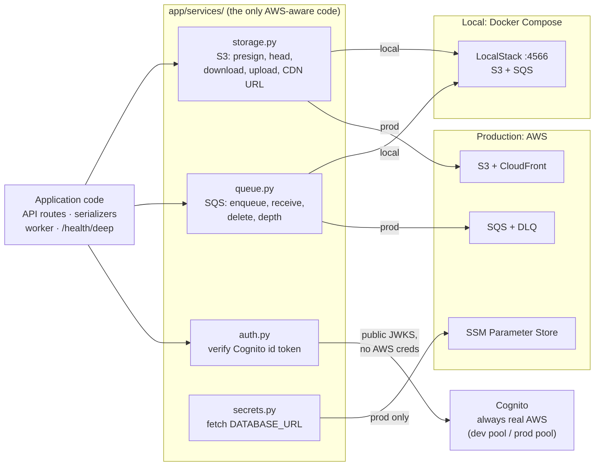
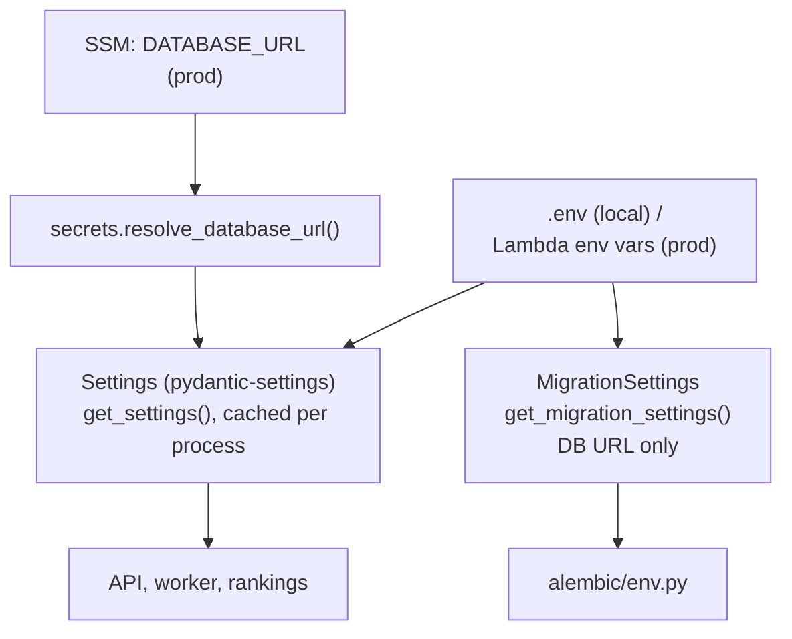

# Services: the AWS seam, config and logging

The small set of modules that know AWS exists, plus the configuration and
logging every entrypoint shares. Code: `backend/app/services/`,
`backend/app/config.py`, `backend/app/logs.py`, `backend/app/db.py`.

← Back to the [architecture overview](../ARCHITECTURE.md).

## How local and cloud differ by configuration alone

No application code branches on the environment. Every AWS client is built
from `get_settings()`, and one variable decides where it points:

- **`AWS_ENDPOINT_URL` set** (`http://localstack:4566`): boto3 talks to
  LocalStack, which emulates S3 and SQS inside Docker Compose. No AWS
  account is needed for these.
- **`AWS_ENDPOINT_URL` empty** (production): boto3 talks to real AWS.

Two services sit outside that seam, each for a reason:

- **Cognito is always the real service**, dev included. LocalStack only
  emulates it on a paid plan, and even there its JWKS support has known
  bugs (see [Decisions](../ARCHITECTURE.md#cognito-is-real-everywhere-not-localstack)).
  Dev and prod are simply two different pools. Verifying a token needs no
  AWS credentials at all: the JWKS endpoint is public.
- **SSM is production-only.** `secrets.py` exists to fetch `DATABASE_URL`
  before `Settings` can be built (below).

## The modules

| Module | Talks to | Used by | Notes |
|---|---|---|---|
| `storage.py` | S3 (LocalStack locally) | clip routes, serializers, worker, health | Defines the key layout (`raw/`, `processed/`, `thumbs/`, `avatars/`). Presigns uploads and downloads, checks an object landed (`head`), and downloads/uploads files for the worker. `public_url(key)` builds a CDN URL from `CDN_BASE_URL`, since the database stores keys, never URLs |
| `queue.py` | SQS (LocalStack locally) | `POST /clips/{id}/complete`, worker poll loop, health | `enqueue`, long-poll `receive_messages`, `delete_message`, `depth`. In prod the worker Lambda doesn't poll; SQS invokes it |
| `auth.py` | Cognito JWKS (always real) | `api/deps.py`, health | Verifies the id token's signature, issuer, audience and `token_use == "id"`. Any failure is a 401 |
| `secrets.py` | SSM Parameter Store (prod only) | `config.py` | A no-op locally, where `DATABASE_URL_SSM_PARAM` is never set |

### Presigned URLs and the public endpoint

Presigned URLs are *signed* against `AWS_ENDPOINT_URL`, which locally is
LocalStack's Docker-network hostname (`localstack`). The signature has to
match that host, but callers *outside* the network (a browser, Postman,
curl on the host) can't resolve it. `Storage._externalize()` swaps in
`AWS_PUBLIC_ENDPOINT_URL` (`http://localhost:4566`) on the way out. In
production that variable is empty, because the real S3 endpoint is already
reachable from anywhere. Any new code that hands a presigned URL to an
outside caller must go through it.

### `DATABASE_URL` comes from SSM in production

Every other prod setting (`S3_BUCKET`, `COGNITO_USER_POOL_ID`, …) is a plain
Lambda environment variable, because none of them are secrets. A full
Postgres connection string is different: a plain Lambda env var is visible
in plaintext to anyone with read-only IAM access to the account (the Lambda
console, or `lambda:GetFunctionConfiguration`), which is a real exposure
surface even in a single-account hobby project. SSM Parameter Store's
`SecureString` type is free at this volume and IAM-gated separately.

The one code-side cost: `secrets.resolve_database_url()` has to read
`os.environ` directly and run *before* `Settings()` can be constructed,
since it exists to produce the value `Settings()` needs. That's a
deliberate, narrow exception to "only `app.config` reads env vars". Locally
it's a no-op and `.env`'s `DATABASE_URL` is used as-is.

## Configuration (`config.py`)

- **Everything comes from `get_settings()`.** Nothing else reads
  `os.environ` (CLAUDE.md convention). It's cached, so a Lambda container
  parses its environment once.
- **Two settings classes.** The full `Settings` requires S3, SQS and CDN
  values. CI's migrate job only has a database URL, so Alembic uses the
  DB-only `MigrationSettings` (see
  [infrastructure](infrastructure.md#migrations-run-before-the-new-image-goes-live-never-after)).
- **Two database URLs, one database.** The app uses `asyncpg`
  (`postgresql+asyncpg://…?ssl=require`), Alembic uses `psycopg`
  (`postgresql+psycopg://…?sslmode=require`). Expected, not a bug.
- **`ANALYZER`** (`stub`/`real`) selects the worker's behaviour. The worker
  image sets `real` itself (see the [analyzer doc](analyzer.md#worker)).

## Database sessions (`db.py`)

One async engine per process with `pool_pre_ping` (Neon drops idle
connections) and a small pool (Lambda containers are frozen between
invocations, so a large pool is wasted connection slots).
`SessionLocal` uses `expire_on_commit=False`, so objects stay readable after
a commit without a lazy reload, which async SQLAlchemy can't do implicitly.
`get_db()` gives each request one session, committed on success and rolled
back on error.

## Logging (`logs.py`)

Every entrypoint (API, worker, rankings) calls `configure_logging()` at
import:

- **Locally**, nothing has configured logging yet, so `basicConfig()`
  installs a stderr handler at INFO.
- **In Lambda**, the runtime has already attached its own handler to the
  root logger, so `basicConfig()` is a silent no-op and the root stays at
  WARNING. Our INFO lines were dropped there from step 5 until 6b. The fix
  sets INFO on our own `tricklens` logger, whose records then propagate to
  whatever root handler exists.

`tests/test_logs.py` reproduces the Lambda setup in a subprocess, including
a control case that drops the line exactly as prod did.
