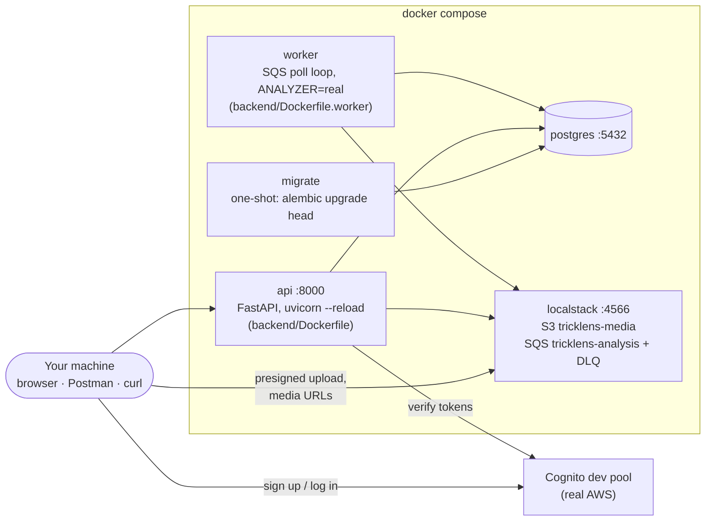

# Development guide

Running TrickLens locally, the commands you'll use, the tests, and
step-by-step walkthroughs of every API area.

← Back to the [README](../README.md) · [Architecture](ARCHITECTURE.md)

## The local stack



| Service | Port | Purpose |
|---|---|---|
| `api` | 8000 | FastAPI with hot reload. `backend/app/` is bind-mounted, so edits reload in under a second |
| `postgres` | 5432 | Local database (throwaway container state) |
| `localstack` | 4566 | Emulated S3 + SQS. `scripts/localstack-init.sh` creates the bucket (CORS, 7-day `raw/` expiry) and both queues on startup |
| `migrate` | — | One-shot `alembic upgrade head`; the API waits for it |
| `worker` | — | Long-polls SQS and runs the real media pipeline and analyzer (`docker compose logs -f worker` to watch) |

`docker compose up` is self-provisioning. A fresh clone needs no manual
setup *except* Cognito, which touches a real AWS account (see
[Auth setup](#auth-setup)).

## Prerequisites

TrickLens is developed on three machines (Windows/WSL2, native Linux, a
MacBook), each an independent clone with its own `.env`.

- **Docker:** Docker Desktop (Windows, macOS) or Docker Engine with the
  compose plugin (Linux).
- **`make`:** `sudo apt install make` on Ubuntu/WSL, `pacman -S make` on
  Arch, the Xcode Command Line Tools on macOS. Every target is a thin
  wrapper, and the raw `docker compose` equivalents are in the
  [Commands](#commands) table.
- **The AWS CLI and an AWS account, for Cognito only.** Postgres, S3 and SQS
  all run locally.
- **Windows:** the repo must live **inside WSL2** (`~/git-repos/TrickLens`),
  never on `/mnt/c`. Bind mounts across the Windows↔Linux boundary make file
  watching slow and can't set the executable bit `scripts/localstack-init.sh`
  needs. Enable Docker Desktop's WSL integration for your distro.
- **macOS:** a native Postgres (notably the postgresql.org/EDB installer) can
  hold port 5432. See [Troubleshooting](#troubleshooting).

## Quick start

```bash
make init    # creates .env from .env.example
make up      # build + start everything
make health  # verify every dependency is reachable
```

Then open <http://localhost:8000/docs> for the interactive API docs. A
healthy `make health` looks like:

```json
{
  "status": "ok",
  "env": "dev",
  "checks": [
    { "name": "postgres", "ok": true, "ms": 2.1, "detail": { "revision": "0008" } },
    { "name": "s3",       "ok": true, "ms": 8.4 },
    { "name": "sqs",      "ok": true, "ms": 6.9, "detail": { "waiting": 0, "in_flight": 0 } },
    { "name": "cognito",  "ok": true, "ms": 41.2 }
  ]
}
```

## Auth setup

Cognito is the one piece of AWS that isn't emulated locally (see
[Decisions](ARCHITECTURE.md#cognito-is-real-everywhere-not-localstack));
dev and prod just use two different real pools. Do this once per machine,
on the host (not in Docker):

1. Create an IAM user with Cognito permissions (the `AmazonCognitoPowerUser`
   managed policy is enough), then `aws configure` with its access key.
2. Run the bootstrap script. It creates a `tricklens-dev` user pool and a
   public app client, and is safe to re-run (it reuses what exists):
   ```bash
   ./scripts/cognito-bootstrap.sh
   ```
3. Paste the two IDs it prints into `.env`:
   ```
   COGNITO_USER_POOL_ID=...
   COGNITO_CLIENT_ID=...
   ```
4. Restart: `make down && make up`.

On another machine, copying those two lines into its `.env` is enough; the
pool is shared.

**Creating a test user** (there's no frontend yet):

```bash
aws cognito-idp sign-up --client-id "$COGNITO_CLIENT_ID" \
  --username skater@example.com --password 'Sk8-or-die1' \
  --user-attributes Name=email,Value=skater@example.com

# Skips real email verification — fine for a dev pool.
aws cognito-idp admin-confirm-sign-up --user-pool-id "$COGNITO_USER_POOL_ID" \
  --username skater@example.com

aws cognito-idp initiate-auth --client-id "$COGNITO_CLIENT_ID" \
  --auth-flow USER_PASSWORD_AUTH \
  --auth-parameters USERNAME=skater@example.com,PASSWORD='Sk8-or-die1'
# → AuthenticationResult.IdToken is the bearer token ($ID_TOKEN below)

curl -X POST localhost:8000/users -H "Authorization: Bearer $ID_TOKEN" \
  -H "Content-Type: application/json" -d '{"username": "nick"}'
curl localhost:8000/users/me -H "Authorization: Bearer $ID_TOKEN"
```

The **id token**, not the access token, is the bearer credential, so
`email` comes from the token itself (see the
[auth flow](ARCHITECTURE.md#auth-flow)).

## Commands

| Command | Does | Without `make` |
|---|---|---|
| `make up` | Build and start all services | `docker compose up -d --build` |
| `make down` | Stop (keeps data) | `docker compose down` |
| `make clean` | Stop and delete volumes — full reset | `docker compose down -v` |
| `make logs` | Tail API logs | `docker compose logs -f api` |
| `make health` | Check every dependency | `curl -s localhost:8000/health/deep` |
| `make migrate` | Apply pending migrations | `docker compose run --rm migrate python -m alembic upgrade head` |
| `make revision m="..."` | Create a new migration | `docker compose run --rm migrate python -m alembic revision -m "..."` |
| `make psql` | Open a psql session | `docker compose exec postgres psql -U tricklens -d tricklens` |
| `make shell` | Bash into the API container | `docker compose exec api /bin/bash` |
| `make fmt` | Format and lint | `docker compose run --rm api python -m ruff format app` |
| `make test` | API-image test suite | `docker compose run --rm api python -m pytest` |
| `make test-worker` | Worker-image tests: media + analyzer | `docker compose run --rm worker python -m pytest <WORKER_TESTS in the Makefile>` |
| `make analyze-clip FILE=...` | Run the analyzer on a local clip and write debug videos | `docker compose run --rm --no-deps --user "$(id -u):$(id -g)" worker python -m app.analyzer.cli <file>` |
| `make licenses` | Fail if any worker-image Python dependency is AGPL | see the `licenses` target in the `Makefile` |
| `make rankings` | Rebuild Discover rankings + team score snapshots | `docker compose run --rm api python -m app.rankings` |
| `make tf-init` / `tf-plan` / `tf-apply` | Terraform against prod (see the [deployment guide](deployment.md)) | `terraform -chdir=infra ...` |

Containers run as root, so anything a container writes into the
bind-mounted repo comes out root-owned. `make analyze-clip` already runs as
your user; pass `--user "$(id -u):$(id -g)"` to any ad-hoc
`docker compose run` that writes files (e.g. `ruff format`).

## Tests

Everything runs against real Postgres and LocalStack, in the same images
production uses. CI runs exactly these commands (see
[infrastructure](components/infrastructure.md#cicd-pipeline)).

- **`make test`** (API image): the whole API, end to end. The API image has
  no ffmpeg or CV stack, so the worker runs its stub scorer here.
- **`make test-worker`** (worker image): the media pipeline, detector,
  tracker, Stage A and Stage B. Most use synthetic signals or ffmpeg's test
  video, so they run in CI. Under `make test` they all skip.
- **Real clips:** `backend/tests/fixtures/clips/` is **gitignored**: real
  skate clips are personal footage and are never committed (the README's
  GIFs are the deliberate exception). With clips present,
  `test_analyzer_real_clips.py` checks the analyzer against timings read
  off their frames; without them (and in CI) those tests skip. Notes on each
  clip are in `test_video_details.md` there.
- **The dev database is shared, persistent state** across test runs and
  manual testing. A test of anything global (Discover rankings) must assert
  presence and relative order of the rows it created, never an exact list.

## Walkthroughs

### Postman

[`postman/TrickLens.postman_collection.json`](../postman/TrickLens.postman_collection.json)
covers every area below. Response values (token, clip id, upload URL) are
saved into the next request's variables automatically.

1. **Import:** Postman → *Import* → select the file.
2. **Variables:** collection → *Variables*. Required: `cognito_client_id`
   (from `.env`). The rest have working defaults.
3. **Make a user:** run the *New User* folder (1 → 4). The *Admin Confirm*
   step uses Postman's AWS Signature auth, so fill `aws_access_key_id` /
   `aws_secret_access_key` and `cognito_user_pool_id` first, in the
   **Current Value** column only (Initial Value syncs to Postman's cloud).
   Or skip it and run `aws cognito-idp admin-confirm-sign-up` instead.
4. **Run it:** *Auth → Login*, *Users → Register* (a 409 later is fine),
   then *Clips* 1 → 6. *Clips → 2. Upload* needs a **real video** picked in
   its Body tab (binary), and its `Content-Type` must match step 1's
   `content_type` (`video/quicktime` for a `.mov`). Re-send *4. Get Clip
   Status* to poll.

The other folders build on that:

- **Social** (follow, unfollow, home feed) needs `follow_username` set to
  another registered user (e.g. `new_username`'s value).
- **Engagement** reuses `clip_id` from the Clips folder.
- **Teams** needs three users: run *New User* once, then *Teams → 0. Third
  Member Setup* once, then *Teams* 1 → 11, interleaving *Clips* steps where
  the requests say to.
- **Discover** reuses `clip_id`; run `make rankings` between its view
  requests and its three GETs.

### Clips

```bash
# 1. Create a draft + get a presigned upload URL
resp=$(curl -s -X POST localhost:8000/clips \
  -H "Authorization: Bearer $ID_TOKEN" -H "Content-Type: application/json" \
  -d '{"content_type": "video/mp4", "duration_ms": 5000, "source_fps": 60}')
clip_id=$(echo "$resp" | python3 -c 'import json,sys;print(json.load(sys.stdin)["clip"]["id"])')
upload_url=$(echo "$resp" | python3 -c 'import json,sys;print(json.load(sys.stdin)["upload_url"])')

# 2. Upload straight to S3 (LocalStack). Must be a real video: the worker
#    ffprobes it and marks junk bytes "unreadable video file"
curl -X PUT "$upload_url" -H "Content-Type: video/mp4" --data-binary @/path/to/clip.mp4

# 3. Confirm the upload landed and queue it for analysis
curl -X POST "localhost:8000/clips/$clip_id/complete" -H "Authorization: Bearer $ID_TOKEN"

# 4. Poll until the worker (docker compose logs -f worker) is done
curl "localhost:8000/clips/$clip_id" -H "Authorization: Bearer $ID_TOKEN"

# 5. Once "analyzed": tag it, optionally tag a team, and publish
curl -X POST "localhost:8000/clips/$clip_id/tricks" \
  -H "Authorization: Bearer $ID_TOKEN" -H "Content-Type: application/json" \
  -d '{"tricks": ["kickflip"]}'

# optional — only while "analyzed", and only for a team you're on; null clears it
curl -X PATCH "localhost:8000/clips/$clip_id/team" \
  -H "Authorization: Bearer $ID_TOKEN" -H "Content-Type: application/json" \
  -d "{\"team_id\": \"$team_id\"}"

curl -X POST "localhost:8000/clips/$clip_id/publish" -H "Authorization: Bearer $ID_TOKEN"

# any time, even after publishing: keep the clip but leave its score out of averages
curl -X PATCH "localhost:8000/clips/$clip_id/score-inclusion" \
  -H "Authorization: Bearer $ID_TOKEN" -H "Content-Type: application/json" \
  -d '{"included": false}'
```

What the worker does with the clip, and what `video_url` / `thumb_url`
point at, is in the [analyzer doc](components/analyzer.md). Until 6c-3 the
score is a stub that fails ~10% of clips on purpose (`model_version:
stub-v1`).

### Seeing what the analyzer saw

```bash
make analyze-clip FILE=tests/fixtures/clips/kickflip_sketchy_60fps.mov   # path relative to backend/
# prints the trick windows, Stage B per trick and timings, and writes to
# backend/tests/fixtures/clips/_debug/:
#   <clip>.debug.mp4           Stage A: boxes, elevation curves, windows
#   <clip>.trick<N>.debug.mp4  Stage B: 60fps at 1/3 speed, skeleton, board, take-off/touch-down
```

### Feed & follows

```bash
curl -X POST localhost:8000/users/otheruser/follow -H "Authorization: Bearer $ID_TOKEN"

# published clips from everyone (and every team) you follow, newest first
curl "localhost:8000/feed?limit=20" -H "Authorization: Bearer $ID_TOKEN"
# next page: pass the previous response's next_cursor back
curl "localhost:8000/feed?limit=20&cursor=<next_cursor>" -H "Authorization: Bearer $ID_TOKEN"

curl -X DELETE localhost:8000/users/otheruser/follow -H "Authorization: Bearer $ID_TOKEN"
```

`GET /users/{username}` reports `follower_count`, `following_count`,
`followed_by_me` (with a token) and `average_score`. Following a team
(`POST/DELETE /teams/{slug}/follow`) surfaces its clips the same way, and a
clip whose author *and* team you follow still shows up once.

### Likes, comments & views

```bash
curl -X POST "localhost:8000/clips/$clip_id/like" -H "Authorization: Bearer $ID_TOKEN"
curl -X DELETE "localhost:8000/clips/$clip_id/like" -H "Authorization: Bearer $ID_TOKEN"

resp=$(curl -s -X POST "localhost:8000/clips/$clip_id/comments" \
  -H "Authorization: Bearer $ID_TOKEN" -H "Content-Type: application/json" \
  -d '{"body": "clean landing!"}')
comment_id=$(echo "$resp" | python3 -c 'import json,sys;print(json.load(sys.stdin)["id"])')

# reply — one level deep only; replying to a reply is a 422
curl -X POST "localhost:8000/clips/$clip_id/comments" \
  -H "Authorization: Bearer $ID_TOKEN" -H "Content-Type: application/json" \
  -d "{\"body\": \"for real\", \"parent_id\": \"$comment_id\"}"

# newest-first top-level comments with replies inline, keyset-paginated
curl "localhost:8000/clips/$clip_id/comments?limit=20" -H "Authorization: Bearer $ID_TOKEN"

# the comment's author or the clip's owner can delete it
curl -X DELETE "localhost:8000/clips/$clip_id/comments/$comment_id" -H "Authorization: Bearer $ID_TOKEN"

# a view — the owner's own views don't count; a rewatch counts again
curl -X POST "localhost:8000/clips/$clip_id/view" -H "Authorization: Bearer $ID_TOKEN"
```

Clip payloads report `like_count`, `comment_count`, `view_count` and
`liked_by_me`. Likes, comments and views need a `published` clip: 404 if
you can't see it at all, 409 if it's your own draft.

### Teams

```bash
# Founding isn't instant: the team stays invisible until BOTH invitees
# accept (≥2 founding invitees is the floor, not a cap)
resp=$(curl -s -X POST localhost:8000/teams \
  -H "Authorization: Bearer $ID_TOKEN" -H "Content-Type: application/json" \
  -d '{
    "name": "Midnight Skaters", "slug": "midnight_skaters",
    "level": "intermediate", "join_policy": "open",
    "invitee_usernames": ["otheruser", "thirduser"]
  }')
slug=$(echo "$resp" | python3 -c 'import json,sys;print(json.load(sys.stdin)["slug"])')

# as each invitee — rejecting instead cancels the whole attempt
curl -X POST "localhost:8000/teams/$slug/invites/mine/accept" -H "Authorization: Bearer $OTHER_TOKEN"
curl -X POST "localhost:8000/teams/$slug/invites/mine/accept" -H "Authorization: Bearer $THIRD_TOKEN"
curl "localhost:8000/teams/$slug" -H "Authorization: Bearer $ID_TOKEN"

# joining depends on join_policy:
#   open        -> POST /teams/{slug}/join makes you a member immediately
#   request     -> POST /teams/{slug}/join creates a pending request; an owner/admin
#                  resolves it via POST /teams/{slug}/join-requests/{username}/accept|reject
#   invite_only -> an owner/admin invites: POST /teams/{slug}/invites {"username": "..."},
#                  and the invitee accepts/rejects (GET /teams/invites/mine lists them)
curl -X POST "localhost:8000/teams/$slug/join" -H "Authorization: Bearer $ID_TOKEN"

# owner-only role changes; removing a member (or yourself, to leave)
curl -X PATCH "localhost:8000/teams/$slug/members/otheruser" \
  -H "Authorization: Bearer $ID_TOKEN" -H "Content-Type: application/json" -d '{"role": "admin"}'
curl -X DELETE "localhost:8000/teams/$slug/members/otheruser" -H "Authorization: Bearer $ID_TOKEN"

curl -X POST "localhost:8000/teams/$slug/follow" -H "Authorization: Bearer $ID_TOKEN"
```

Teams cap at 20 members. `level`, `join_policy` and the description are
editable by the owner (`PATCH /teams/{slug}`). The rules behind founding,
roles and invites are in the [data model doc](components/data-model.md#design-notes).

### Discover

Rankings aren't computed live. Rebuild them first:

```bash
make rankings
```

```bash
# this week's top clips by steeze_score (score_included=false clips left out)
curl "localhost:8000/discover/clips?sort=score&limit=20" -H "Authorization: Bearer $ID_TOKEN"

# same clips by engagement (view×1 + like×5 + comment×10)
curl "localhost:8000/discover/clips?sort=engagement&limit=20" -H "Authorization: Bearer $ID_TOKEN"

# teams by score increase over ~7 days (needs a week of history)
curl "localhost:8000/discover/teams?limit=20" -H "Authorization: Bearer $ID_TOKEN"
```

`average_score` on users and teams is live; only the two `/discover/*`
rankings depend on `make rankings`. How it works:
[api.md](components/api.md#feed-and-discover).

## Troubleshooting

| Symptom | Cause |
|---|---|
| `localstack` never becomes healthy | `scripts/localstack-init.sh` isn't executable. `make up` chmods it; on `/mnt/c` that can't work — move the repo into WSL. |
| `docker compose up` fails with `error mounting ... "/etc/localstack/init/ready.d/init.sh": no such file or directory` | Docker Desktop (WSL2) lost the existing container's single-file bind mount, usually after it restarts. `docker compose up -d --force-recreate localstack`. |
| `postgres` fails to start: port 5432 in use (macOS) | A native Postgres (the EDB installer runs as an always-on `launchd` daemon). `lsof -nP -iTCP:5432 -sTCP:LISTEN`, then `sudo launchctl disable system/postgresql-<version>`. |
| `api` exits immediately | `migrate` failed. Check `docker compose logs migrate`. |
| Edits don't hot-reload | Repo is on the Windows filesystem. Move it into WSL. |
| `/health/deep` returns 503 | Read the failing check's `error` field — it names the dependency. |
| `postgres` check: "schema at revision X, code expects Y" | Run `make migrate`. |
| `cognito` check fails, or every request 401s | `COGNITO_USER_POOL_ID`/`COGNITO_CLIENT_ID` empty or wrong. Run `./scripts/cognito-bootstrap.sh` and restart. |
| Uploading to the presigned URL fails to connect / DNS error | `AWS_PUBLIC_ENDPOINT_URL` missing from `.env` (needs `http://localhost:4566`), or the API wasn't restarted. See [services](components/services.md#presigned-urls-and-the-public-endpoint). |
| A clip never leaves `queued` | `docker compose logs -f worker` should show `polling <queue url>` and one line per message. If you just restarted the worker, its message may be stuck in flight for 10 minutes (CLAUDE.md gotcha): wait ~20s after a restart before enqueueing. |
| A real video comes back `unanalyzable`: "unreadable video file" / "no video stream found" / "clip too short" | That's ffprobe's verdict on the file, not a scoring failure. Check it with `ffprobe <file>`. |
| `unanalyzable` with another reason and `model_version: stub-v1` | The stub scorer's deliberate ~10% fake failure, until 6c-3. Not a bug. |
| `OSError: libEGL.so.1` from MediaPipe | The worker image lacks `mesa-libEGL`/`libglvnd-gles`. Rebuild it: `docker compose build worker`. |
| Root-owned files appear in the repo | A container wrote them. Delete via a container, and run future writes with `--user "$(id -u):$(id -g)"`. |
